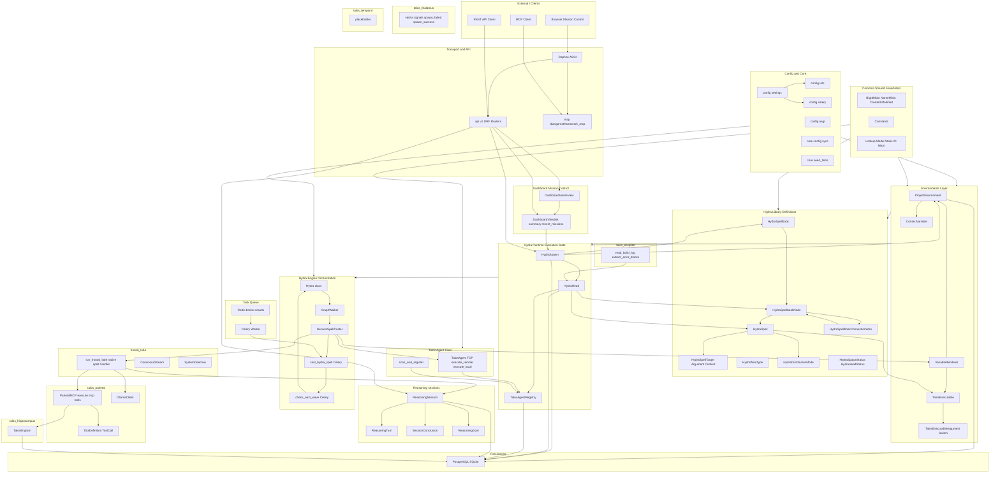
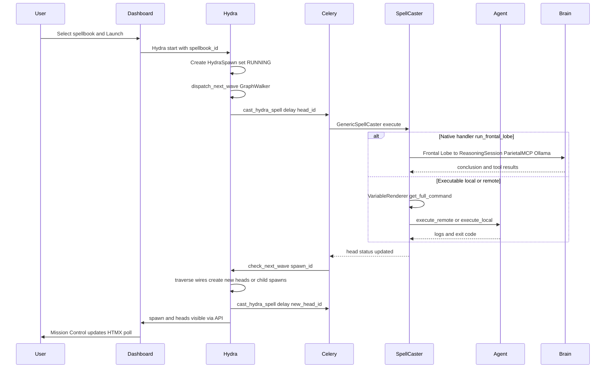

# Talos Abstract Architecture

This document provides a comprehensive, detailed graph of Talos’s abstract architecture: layers, components, data flow, and control flow.

---

## 1. High-Level System Context

Talos is a **Django-based mission control system** for orchestrating Unreal Engine 5 build pipelines across a distributed fleet. It combines:

- **Orchestration:** Graph-based protocols (spellbooks) executed as missions (spawns) with discrete steps (heads).
- **Execution:** Local and remote execution via Talos Agents over a custom TCP protocol.
- **Cognitive layer:** Reasoning sessions, tools (MCP-style), and memory (engrams) driven by a “frontal lobe” spell.
- **User surface:** Mission Control dashboard (HTMX), REST API, and MCP endpoint.

---

## 2. Layered Architecture Diagram

---

## 3. Control and Data Flow (Simplified)

---

## 4. Component Summary

| Layer | Key components | Responsibility |
|-------|-----------------|----------------|
| **Transport** | Daphne, REST (`api/v1/`), MCP (`/mcp/`) | HTTP/ASGI entry, routing to apps |
| **Config & Core** | settings, urls, celery, asgi, config_manager, seed_talos | Project config, bootstrap, DB seed |
| **Common** | Mixins, constants, lookup pattern | Shared model base and conventions |
| **Environments** | ProjectEnvironment, TalosExecutable, VariableRenderer | Context and path resolution for spells |
| **Hydra Library** | Spellbook, Node, Spell, Wire, DistributionMode, Status lookups | Protocol and spell definitions |
| **Hydra Runtime** | HydraSpawn, HydraHead | One mission run and per-step execution state |
| **Hydra Engine** | Hydra class, GraphWalker, GenericSpellCaster, Celery tasks | Start, wave dispatch, spell execution, next wave |
| **Celery** | Redis, cast_hydra_spell, check_next_wave | Async execution and chaining |
| **Talos Agent** | TalosAgentRegistry, TalosAgent TCP server, discovery | Fleet registry and remote/local execution |
| **Dashboard** | DashboardHomeView, DashboardViewSet | Mission Control UI and summary API |
| **Brain** | Thalamus (signals), Frontal (directives, frontal spell), Parietal (tools, MCP, Ollama), Occipital (log reading), Reasoning (sessions/turns/conclusions), Hippocampus (engrams), Temporal (stub) | Routing, reasoning, tools, log vision, memory |

---

## 5. Key Conventions Reflected in the Graph

- **Strict ID pattern:** Status and mode fields use **Lookup models + static ID class + Mixin** (e.g. `HydraStatusID`, `HydraHeadStatus`); no `TextChoices` or string literals for status.
- **Environment scoping:** Spellbooks, nodes, and spawns use **ProjectEnvironmentMixin**; commands and paths are rendered via **VariableRenderer** with environment context.
- **Execution model:** One **HydraHead** per graph node execution; heads run in Celery via **cast_hydra_spell**; **check_next_wave** drives the next wave and sub-spawns.
- **Brain integration:** The **run_frontal_lobe** native handler creates/resumes a **ReasoningSession**, uses **OllamaClient** and **ParietalMCP** for tools (including engrams), and completes when the model calls **mcp_conclude_session**.

This graph and the tables above describe the **abstract architecture** of Talos; for file-level detail and app responsibilities, see [CODEBASE_OVERVIEW.md](CODEBASE_OVERVIEW.md).
