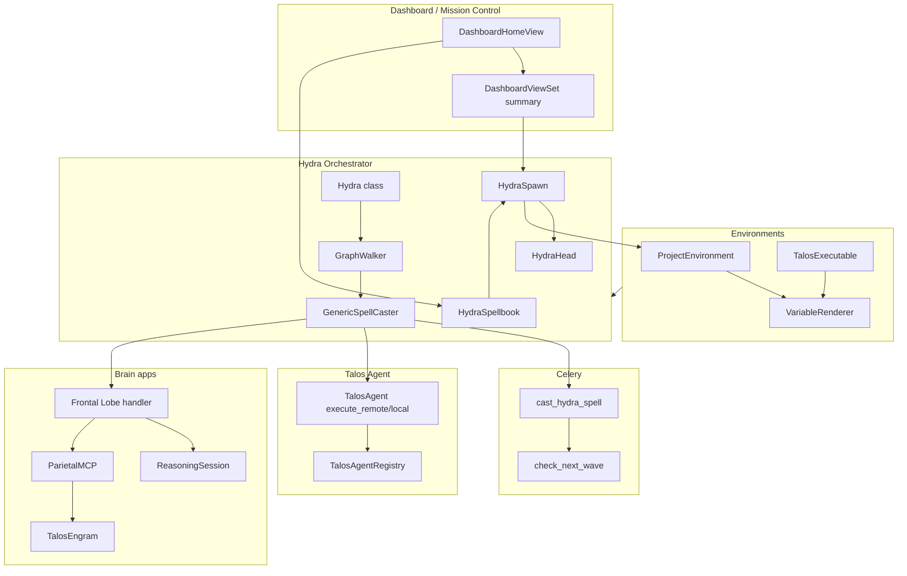

# Talos Codebase: Comprehensive Overview

## 1. Project identity and tech stack

**Talos** is a Django-based mission control system for orchestrating Unreal Engine 5 build pipelines across a distributed fleet of remote agents. It provides a dashboard (Mission Control), graph-based protocols (spellbooks), async execution via Celery, and an integrated "cognitive" layer (reasoning sessions, engrams, MCP tools).

- **Backend:** Django 6.x on Daphne ASGI; Celery 5.x + Redis; PostgreSQL (prod) / SQLite (dev).
- **Frontend:** HTMX, minimal JS; dark-mode UI (Inter/Outfit, glassmorphism).
- **Fleet protocol:** Custom TCP-based agent protocol (e.g. port 5005) for remote execution and log streaming.
- **Standards:** [.cursor/rules/talos-engineering-standards.mdc](.cursor/rules/talos-engineering-standards.mdc) — Lookup models for statuses (no TextChoices), `BigIdMixin`/`NameMixin`, Google-style docstrings, strict testing (no writes to live DB in tests).

---

## 2. Config and core (project spine)

**config/** — Django project config.

- **config/settings.py:** `INSTALLED_APPS` (core, common, dashboard, talos_agent, hydra, celery, environments, talos_thalamus, talos_frontal, talos_parietal, talos_occipital, talos_temporal, talos_reasoning, talos_hippocampus, djangorestframework_mcp, rest_framework, etc.), DB (PostgreSQL by default), Celery broker (Redis), REST_FRAMEWORK, LOGGING.
- **config/urls.py:** Root routing: `''` → dashboard; `hydra/`, `environments/`, `reasoning/`; `api/v1/` (merged routers from environments, hydra, dashboard, talos_reasoning); `admin/`, `api-auth/`, `mcp/` (djangorestframework_mcp).
- **config/celery.py:** Celery app `talos`, config from Django settings (`CELERY_*`), `autodiscover_tasks()`.
- **config/asgi.py:** Standard `get_asgi_application()` (no custom channel routing in the explored code).

**core/** — Shared project utilities and bootstrap; no domain models.

- **core/utils/config_manager.py:** `load_builder_config()` (reads `Legacy/builder_config.json`), `sync_targets_from_config()` — syncs "RemoteTargets" into **TalosAgentRegistry** (create/update agents from config).
- **core/tasks.py:** Celery tasks for network scan and agent discovery (bodies currently commented out); would call config sync and scanner.
- **core/management/commands/seed_talos.py:** Discovers all `*/fixtures/*.json`, loads them in dependency order (multiple passes on IntegrityError) so Hydra protocols, environments, executables, etc. are seeded.

---

## 3. Common (shared model mixins)

**common/models.py** — Abstract mixins used across apps.

- **Timing/audit:** `CreatedMixin`, `ModifiedMixin`, `CreatedByMixin`, `ModifiedByMixin`, `CreatedAndModifiedBy`, `CreatedAndModifiedWithDelta`.
- **Naming/IDs:** `NameMixin` (name, `__str__`, natural_key), `BigIdMixin` (BigAutoField), `UUIDIdMixin`, `DefaultFieldsMixin`.
- **Content:** `DescriptionMixin`.
- **Admin/URLs:** `DjangoAdminReverseRequirementsMixin` (get_absolute_url, get_admin_url).

Constants (e.g. `STANDARD_CHARFIELD_LENGTH`) live in **common/constants**. Status and similar lookups follow the rule: **Lookup model + static ID class + Mixin** (e.g. HydraStatusID + HydraHeadStatus), not TextChoices.

---

## 4. Environments (context and executables)

**environments/** — Project environments and executable definitions; provides the context and path resolution used by Hydra and the dashboard.

- **Models (environments/models.py):**
  - **ProjectEnvironment** — One active "selected" environment sitewide; FK to ProjectEnvironmentType, ProjectEnvironmentStatus; UUID pk.
  - **ContextVariable** — Key (ProjectEnvironmentContextKey) + value per environment; used by **VariableRenderer** for `{{ key }}` substitution.
  - **TalosExecutable** — Executable path, log path, optional working path; M2M switches, related arguments and supplementary paths; `get_rendered_executable(environment)`.
  - **TalosExecutableArgument**, **TalosExecutableSwitch**, **TalosExecutableArgumentAssignment**, **TalosExecutableSupplementaryFileOrPath** — Arguments and flags for executables.
  - **ProjectEnvironmentMixin** — Abstract: nullable FK to ProjectEnvironment; used by **HydraSpellbook**, **HydraSpellbookNode**, **HydraSpawn** so protocols and runs are scoped to an environment.
- **Variable resolution:** environments/variable_renderer.py — `VariableRenderer.extract_variables(environment)`, `render_string(template_string, context)`; base context (e.g. hostname) + environment ContextVariables.
- **URLs:** `environments/select/<uuid:pk>/` → SelectEnvironmentView (sets selected env).
- **API:** ProjectEnvironmentViewSet (CRUD + `select`), TalosExecutableViewSet; both exposed under `api/v1/` and decorated with `@mcp_viewset()` for MCP.

Hydra spellbooks and spawns are tied to an environment; spell command lines and paths are rendered per environment via this app.

---

## 5. Hydra (orchestrator and protocol engine)

**hydra/** — Core orchestration: graph-based protocols (spellbooks), spawns (missions), heads (single execution units), and spell execution.

### 5.1 Models and concepts

- **Library/definitions (hydra/models.py):**
  - **HydraTag,** **HydraStatusID / HydraSpawnStatus, HydraHeadStatus** — Tags and status lookups (CREATED, PENDING, RUNNING, SUCCESS, FAILED, ABORTED, DELEGATED, STOPPING, STOPPED, etc.).
  - **HydraDistributionMode** — LOCAL_SERVER, ALL_ONLINE_AGENTS, ONE_AVAILABLE_AGENT, SPECIFIC_TARGETS.
  - **HydraSpell** — One actionable step: FK to TalosExecutable, M2M TalosExecutableSwitch, distribution_mode; `get_full_command(environment, extra_context)` uses VariableRenderer; special spell id e.g. BEGIN_PLAY = 1.
  - **HydraSpellContext**, **HydraSpellArgumentAssignment**, **HydraSpellTarget** — Spell-level context, argument order, and (for SPECIFIC_TARGETS) pinned agents.
  - **HydraSpellbook** — Protocol/graph container; ProjectEnvironmentMixin, ui_json, tags/favorites.
  - **HydraSpellbookNode** — Graph node: spellbook, spell (or invoked_spellbook for sub-graph), optional distribution_mode, is_root, ui_json.
  - **HydraSpellBookNodeContext** — Node-level key/value overrides.
  - **HydraWireType**, **HydraSpellbookConnectionWire** — Wires between nodes (e.g. success/failure flow).
- **Runtime:**
  - **HydraSpawn** — One run of a spellbook (mission); FK spellbook, status, environment, optional parent_head (for sub-graphs).
  - **HydraHead** — One execution unit: spawn, node, spell, status, optional target (TalosAgentRegistry), celery_task_id, spell_log, execution_log, result_code, blackboard (JSON).

### 5.2 Orchestrator and execution flow

- **hydra/hydra.py** — Class **Hydra(spellbook_id=… | spawn_id=…)**:
  - **start()** — Idempotent start: set spawn to RUNNING, then dispatch first wave.
  - **dispatch_next_wave()** — Uses **GraphWalker** to process heads: roots first; when a head finishes, traverse wires and create new heads for downstream nodes; sub-graph nodes create a child spawn and set parent head to DELEGATED.
  - **terminate()** / **stop_gracefully()** — Abort or signal heads; revoke Celery tasks.
- **hydra/engine/graph_walker.py** — **GraphWalker(spawn_id)**:
  - **process_node(head)** — If head already terminal → traverse wires; if node has invoked_spellbook → spawn subgraph and delegate; if node has spell → execute spell; else mark SUCCESS and traverse.
  - Execution is delegated to **GenericSpellCaster** (one head at a time).
- **hydra/tasks.py**:
  - **cast_hydra_spell(head_id)** — Celery task: loads head, sets celery_task_id, runs **GenericSpellCaster(head_id).execute()**, then in `finally` calls **check_next_wave(spawn_id)** so the next wave is dispatched when the spell completes.
  - **check_next_wave(spawn_id)** — Hydra(spawn_id=…).dispatch_next_wave().

So: **Launch** creates a spawn and kicks the first wave; each head runs in a Celery task; when a task finishes, the next wave is automatically checked and further heads are enqueued (or sub-graphs started).

### 5.3 Spell casting and handlers

- **hydra/spells/spell_casters/generic_spell_caster.py** — **GenericSpellCaster(head_id)**:
  - Resolves environment; if the node's spell is in **NATIVE_HANDLERS** (e.g. `begin_play`, `update_version_metadata`, `scan_and_register`, `spellbook_logic_node`, **run_frontal_lobe**), runs that handler; otherwise runs executable (local or remote via **TalosAgent**).
  - Uses **VariableRenderer** and **TalosAgent.execute_remote** / **execute_local** for command execution; **AsyncLogManager** for spell_log vs execution_log.
- **NATIVE_HANDLERS** map spell names to Python callables; **run_frontal_lobe** is the "AI reasoning" spell that drives the Frontal Lobe loop (see Brain apps below).

### 5.4 HTTP and API

- **hydra/urls.py:** Graph editor (`graph/editor/<book_id>/`), graph monitor (`graph/spawn/<spawn_id>/`), launch (`launch/<spellbook_id>/`, `graph/<book_id>/launch/`), head detail, spawn terminate/stop, battle station, download logs.
- **hydra/api_urls.py** + **hydra/api.py:** ViewSets for spawns, spellbooks, heads, spells, nodes, wires, node-contexts; spawn create = launch (Hydra(spellbook_id=…).start()); actions like live_status, heads, stop, terminate. Registered on v1 router; ViewSets are `@mcp_viewset()` for MCP.

---

## 6. Talos Agent (fleet and remote execution)

**talos_agent/** — Remote agent registry, telemetry, and execution (local or over TCP).

- **Models (talos_agent/models.py):** TalosAgentStatus (OFFLINE, ONLINE, IN_USE); **TalosAgentRegistry** (status, hostname, ip_address, port, version, last_seen); **TalosAgentTelemetry** (CPU, memory, is_functioning, etc.); **TalosAgentEvent** (lifecycle; noted as unused in exploration).
- **Runtime (talos_agent/talos_agent.py):** **TalosAgent** — Async TCP server (e.g. port 5005); commands PING, EXECUTE, UPDATE_SELF, STOP. **execute_local** / **execute_remote** run pipelines (subprocess or remote) and stream log/exit code.
- **Discovery:** **talos_agent_finder** — `scan_and_register()` used to discover agents on the subnet and register them in DB; used by spell caster when it needs an agent.
- **Integration:** **core** syncs `builder_config.json` RemoteTargets → TalosAgentRegistry; **hydra** (GenericSpellCaster) selects online agents by distribution mode and calls **TalosAgent.execute_remote(hostname, …)** or **execute_local**.

URLs are mounted under **dashboard**: `agent-detail/<uuid:pk>/`, …/metrics/, launch/, kill/, logs/, log-feed/, update/.

---

## 7. Dashboard (Mission Control UI)

**dashboard/** — Main user-facing "Mission Control" and API for summary data.

- **Views (dashboard/views.py):** **DashboardHomeView** — Renders `mission_control.html`; context: environments, active_environment, spellbooks (favorites, tagged, uncategorized), last_cortex_session (ReasoningSession).
- **URLs:** `''` → DashboardHomeView; `agent-detail/` → include(talos_agent.urls).
- **API (dashboard/api.py, api_urls.py):** **DashboardViewSet** — **summary** (GET): server_time, optional environments/spellbooks (e.g. when static=true or first load), **recent_missions** = root HydraSpawn with environment__selected=True (serialized for swimlanes); supports `last_sync` for conditional polling (204 if unchanged). **shutdown** (POST): Celery shutdown + delayed exit.
- **Templates:** mission_control.html (env selector, spellbook groups, spawns area, chat toggle, hydra JS/CSS), home.html, base templates, partials (environment_row, launch_row, hydra_button, mission_swimlane, head_card, chat_window, agent_list, etc.).

Dashboard triggers launch via hydra URLs (e.g. POST to launch); Mission Control JS polls `/api/v1/dashboard/summary/` and calls hydra REST for stop/terminate and spawn rerun.

---

## 8. Talos "brain" apps (cognitive layer)

These apps implement a metaphorical "brain": routing (thalamus), thought/directives (frontal), tools and MCP (parietal), log "vision" (occipital), time placeholder (temporal), reasoning sessions (reasoning), and memory (hippocampus).

### 8.1 talos_thalamus — Routing / signals

- **Purpose:** Receives Hydra signals and can route "stimuli" to other components.
- **Models:** **Stimulus** (plain Python: source, description, context_data).
- **Signals (talos_thalamus/signals.py):** Receivers for `spawn_failed` and `spawn_success` from hydra.signals; handlers currently no-op (hooks for future behavior).
- **Apps:** ready() imports signals so receivers register.

### 8.2 talos_frontal — Directives and command parsing

- **Purpose:** System prompts (directives), "stream of thought" (ConsciousStream), and parsing of AI text into tool calls.
- **Models (talos_frontal/models.py):** SystemDirectiveIdentifier, **SystemDirective** (template, version, is_active, context_window_size, etc.; format_prompt, required_variables); ConsciousStatus; **ConsciousStream** (linked to HydraSpawn/HydraHead, current_thought, status, used_prompt, token counts, model_name).
- **Utils (talos_frontal/utils.py):** **parse_command_string(text)** — Parses READ_FILE, SEARCH_FILE, LIST_DIR, ai_read_file-style lines into {tool, args}.

### 8.3 talos_parietal — Tools registry and MCP gateway

- **Purpose:** Tool definitions for the LLM and MCP-style execution (file ops, engrams, blackboard, goals, session conclusion, model/record queries).
- **Models (talos_parietal/models.py):** ToolParameterType, ToolUseType, **ToolDefinition**, ToolParameter, ToolParameterAssignment, ParameterEnum, **ToolCall** (ReasoningTurn, ToolDefinition, arguments, result_payload, traceback).
- **Parietal MCP (talos_parietal/parietal_mcp/gateway.py):** **ParietalMCP.execute(tool_name, args)** — Loads `talos_parietal.parietal_mcp.{tool_name}` and calls the same-named async function; tool names must start with `mcp_`. Tools include: mcp_read_file, mcp_grep, mcp_list_files, mcp_engram_save/read/search/update, mcp_update_blackboard, mcp_update_goal, mcp_conclude_session, mcp_query_model, mcp_read_record_field, mcp_search_record_field, mcp_inspect_record, etc.
- **Synapse (talos_parietal/synapse.py):** **OllamaClient** for chat/tool-calling; builds request/response. **tools.py** — Sandboxed path helpers and file tools (ai_read_file, ai_search_file, ai_list_files).

### 8.4 talos_occipital — Log "vision"

- **Purpose:** Interpret build/log output: extract error blocks, truncate by token budget for downstream (e.g. analysis).
- **No DB models.** talos_occipital/readers.py: CONCERN_PATTERNS / IGNORE_PATTERNS; **extract_error_blocks(full_log_content)**; **read_build_log(run_id, max_token_budget)** — Loads HydraSpawn, heads (prefer FAILED), concatenates spell logs, returns error summary + tail (truncated).

### 8.5 talos_temporal — Placeholder

- **Purpose:** Named for temporal sequencing; currently stub (apps.py only).

### 8.6 talos_reasoning — Sessions, turns, goals, conclusions

- **Purpose:** Multi-turn reasoning tied to a HydraHead: goals, turns, tool calls, conclusions; REST API and UI.
- **Models (talos_reasoning/models.py):** ReasoningStatus (lookup); ReasoningStatusMixin; **ModelRegistry** (LLM config); **ReasoningSession** (FK HydraHead, max_turns, total_xp, current_focus; level/focus_regen); **ReasoningGoal** (session, achieved, rendered_goal); **ReasoningTurn** (session, turn_number, request_payload, token counts, turn_goals M2M, thought_process); **SessionConclusion** (summary, reasoning_trace, outcome_status, recommended_action, next_goal_suggestion; property engrams).
- **API:** ReasoningSessionViewSet under `api/v1/` (list/detail, **graph_data**, **rerun** — resets head and re-runs via cast_hydra_spell.delay(head.id)).
- **URLs:** `reasoning/interface/<uuid:session_id>/`, `reasoning/lcars/<uuid:session_id>/`.

### 8.7 talos_hippocampus — Memory (engrams)

- **Purpose:** Long-term memory: engrams (facts) linked to sessions, turns, heads.
- **Models (talos_hippocampus/models.py):** TalosEngramTag; **TalosEngram** (name, description, M2M to ReasoningSession, ReasoningTurn, HydraHead, TalosEngramTag; is_active, relevance_score, vector_id). Used by SessionConclusion.engrams and by parietal MCP tools (mcp_engram_save, mcp_engram_read, mcp_engram_search, mcp_engram_update).

---

## 9. How the "brain" ties into Hydra

- **Frontal Lobe spell:** A **HydraSpell** can be configured to use the **run_frontal_lobe** native handler. When a **HydraHead** runs that spell, hydra/spells/spell_casters/spell_handlers/frontal_lobe_handler.py runs:
  - Creates or resumes a **ReasoningSession** for that head; uses **OllamaClient** (parietal) for chat and tool calls.
  - Tool calls from the model are executed via **ParietalMCP.execute()** (mcp_update_blackboard, mcp_engram_*, mcp_conclude_session, file/record tools, etc.).
  - **ToolCall** records are stored (talos_parietal); session/turns/goals in talos_reasoning; engrams in talos_hippocampus. When the model calls **mcp_conclude_session**, the session is concluded and the Frontal Lobe spell can complete.

So: **Hydra (spell) → GenericSpellCaster → run_frontal_lobe → FrontalLobe (ReasoningSession, OllamaClient, ParietalMCP) → engrams / blackboard / conclusions.** Occipital can be used to feed truncated build logs into that pipeline; thalamus can react to spawn success/failure later.

---

## 10. MCP (Model Context Protocol)

- **djangorestframework_mcp** is mounted at `/mcp/` (config/urls.py).
- ViewSets in **environments** and **hydra** are decorated with **@mcp_viewset()**, exposing environment and hydra resources to MCP clients.
- **Parietal MCP** is an internal async gateway (ParietalMCP.execute) used by the Frontal Lobe handler to run `mcp_*` tools; it is not the same as the HTTP MCP mount but shares the "tool" naming convention.

---

## 11. High-level architecture (data and control flow)

---

## 12. File and app quick reference

| Layer / App           | Role                           | Key files / entry points                                                                                                                                     |
| --------------------- | ------------------------------ | ------------------------------------------------------------------------------------------------------------------------------------------------------------ |
| **config**            | Settings, URLs, Celery, ASGI   | settings.py, urls.py, celery.py, asgi.py                                                                                                                     |
| **core**              | Config sync, seed, tasks       | utils/config_manager.py, management/commands/seed_talos.py, tasks.py                                                                                         |
| **common**            | Model mixins, constants        | models.py, constants                                                                                                                                         |
| **environments**      | Envs, executables, variables   | models.py, variable_renderer.py, api.py, urls.py                                                                                                             |
| **hydra**             | Orchestrator, graph, spells    | hydra.py, models.py, tasks.py, engine/graph_walker.py, spells/spell_casters/generic_spell_caster.py, spell_handlers/frontal_lobe_handler.py, api.py, urls.py |
| **talos_agent**       | Fleet, remote execution        | models.py, talos_agent.py, talos_agent_finder.py, urls.py                                                                                                    |
| **dashboard**         | Mission Control UI + summary   | views.py, api.py, urls.py, templates/dashboard/                                                                                                               |
| **talos_thalamus**    | Hydra signal routing           | signals.py, models.py                                                                                                                                        |
| **talos_frontal**     | Directives, stream, parsing    | models.py, utils.py                                                                                                                                          |
| **talos_parietal**    | Tools, MCP gateway, Ollama     | models.py, parietal_mcp/gateway.py, synapse.py, tools.py                                                                                                     |
| **talos_occipital**   | Log reading / error extraction | readers.py                                                                                                                                                   |
| **talos_temporal**    | Placeholder                    | apps.py                                                                                                                                                      |
| **talos_reasoning**   | Sessions, turns, conclusions   | models.py, api.py, api_urls.py, urls.py                                                                                                                     |
| **talos_hippocampus** | Engrams (memory)               | models.py                                                                                                                                                    |

This is the structure and flow of the Talos codebase; each part is used either for build orchestration (environments → hydra → agents) or for the AI reasoning pipeline (hydra frontal spell → reasoning + parietal MCP + hippocampus), with the dashboard and REST/MCP APIs as the user and integration surface.
