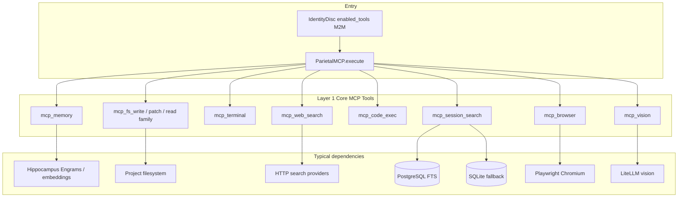
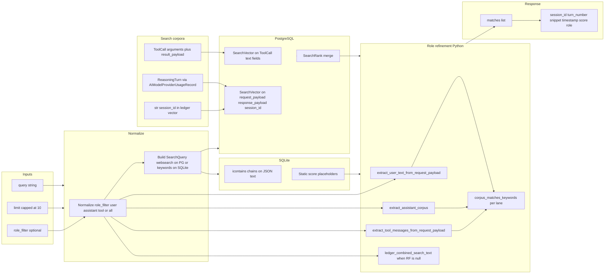
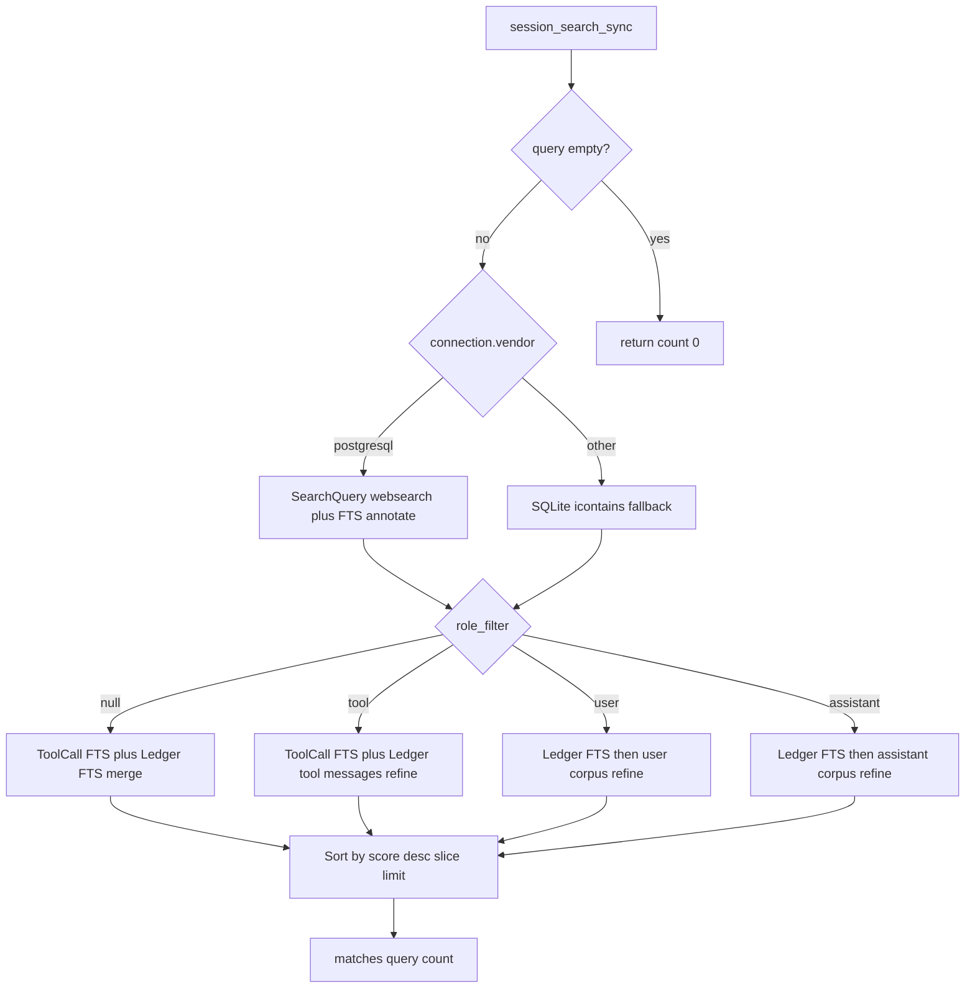
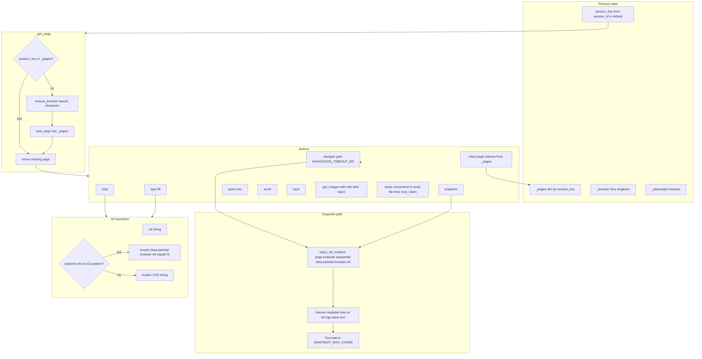
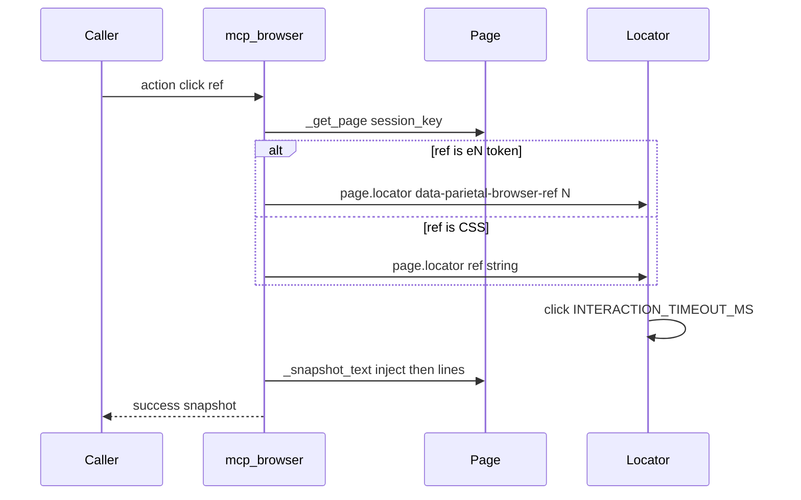
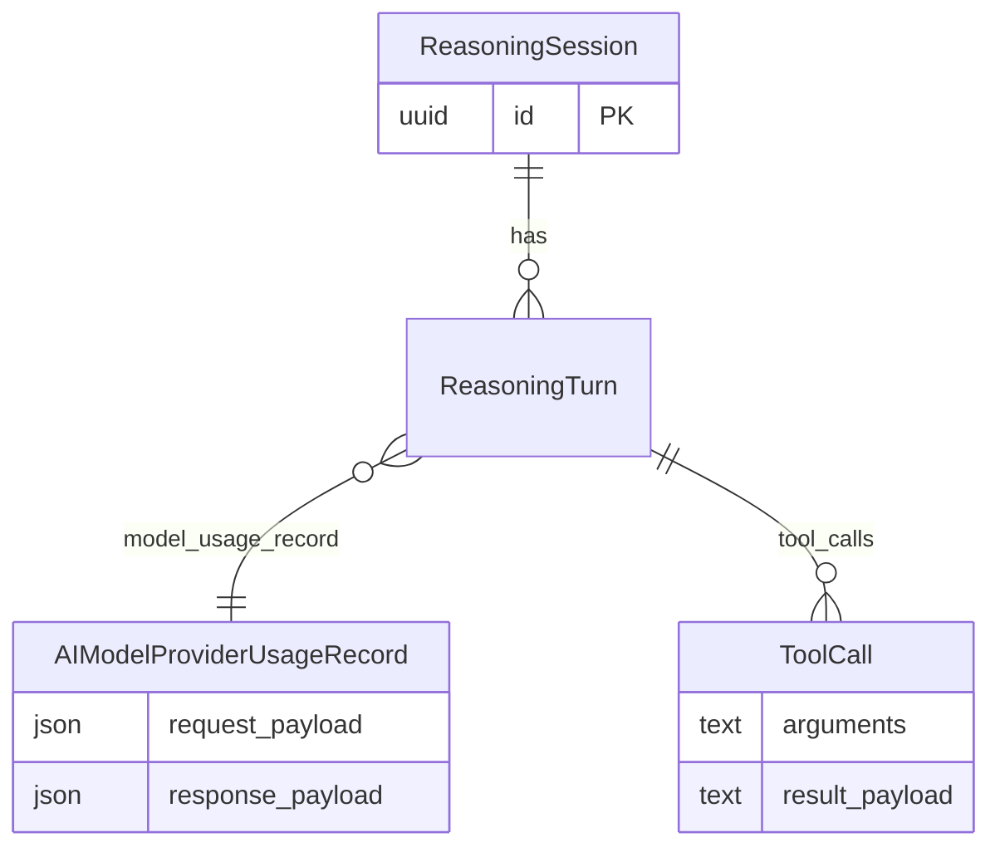

# Layer 1 implementation flow

This document captures **Mermaid flow diagrams** for the Layer 1 core MCP tool suite: how tools connect to the gateway, how `mcp_session_search` routes queries across corpora and databases, and how `mcp_browser` manages Playwright pages, `@eN` refs, and actions.

See also [LAYER_1_CORE_TOOLS_PLAN.md](LAYER_1_CORE_TOOLS_PLAN.md) for the full tool list and specifications.

---

## 1. Layer 1 in the execution stack (gateway to tools)

---

## 2. `mcp_session_search` — query to corpora to rank to response

---

## 3. `mcp_session_search` — which lanes run (role and vendor)

---

## 4. `mcp_browser` — session page lifecycle and actions

---

## 5. `mcp_browser` — ref vs CSS (interaction sequence)

---

## 6. Session search data model (ORM relationships)

