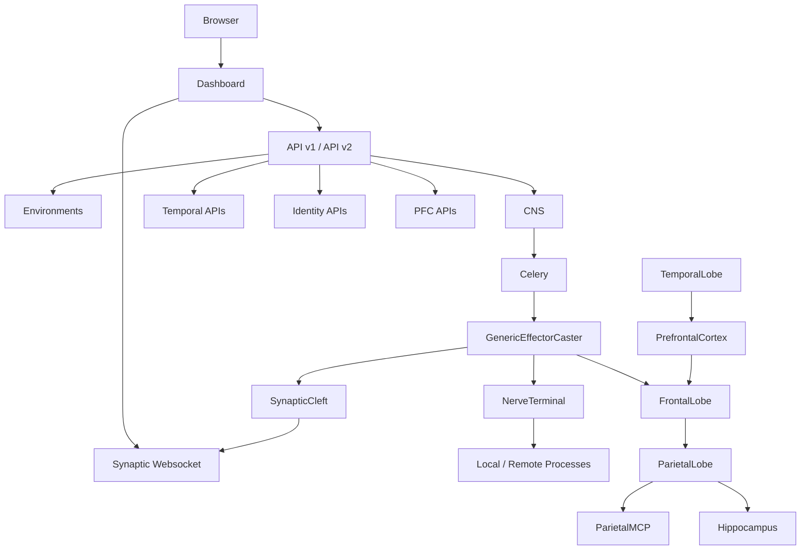

# Talos Live Codebase Analysis

Talos, as it is actually wired today, is a Django control plane for two coupled systems:

1. A graph-based orchestration engine that launches and monitors build or automation steps across the local machine and remote agents.
2. An autonomous reasoning engine that staffs identity-driven AI workers, gives them tools, stores their memory, and lets them manipulate an Agile work graph.

The most important architectural fact is that the live runtime is not the older `hydra/` tree described in some docs. The active request path is the `central_nervous_system` stack registered in `config/settings.py` and routed from `config/urls.py`, plus the brain-themed apps around it. The repo still contains older or parallel codepaths, but the live system is the CNS-based one described below.

```python
v1_router = routers.DefaultRouter()
v1_router.registry.extend(ENVIRONMENTS_ROUTER.registry)
v1_router.registry.extend(CNS_ROUTER.registry)
v1_router.registry.extend(DASHBOARD_ROUTER.registry)
v1_router.registry.extend(V2_REASONING_ROUTER.registry)

V2_ROUTER = routers.DefaultRouter()
V2_ROUTER.registry.extend(V2_CNS_ROUTER.registry)
V2_ROUTER.registry.extend(DASHBOARD_ROUTER.registry)
V2_ROUTER.registry.extend(V2_TEMPORAL_LOBE_ROUTER.registry)
V2_ROUTER.registry.extend(V2_IDENTITY_ROUTER.registry)
V2_ROUTER.registry.extend(V2_PREFRONTAL_CORTEX_ROUTER.registry)
V2_ROUTER.registry.extend(V2_HIPPOCAMPUS_ROUTER.registry)
V2_ROUTER.registry.extend(V2_REASONING_ROUTER.registry)
V2_ROUTER.registry.extend(V2_PARIETAL_LOBE.registry)
V2_ROUTER.registry.extend(V2_PNS_ROUTER.registry)

urlpatterns = [
    path("", include("dashboard.urls")),
    path("central_nervous_system/", include("central_nervous_system.urls.urls")),
    path("environments/", include("environments.urls")),
    path("reasoning/", include("frontal_lobe.urls")),
    path("api/v1/", include(v1_router.urls)),
    path("api/v2/", include(V2_ROUTER.urls)),
    path("admin/", admin.site.urls),
    path("api-auth/", include("rest_framework.urls", namespace="rest_framework")),
    path("mcp/", include("djangorestframework_mcp.urls")),
]
```



## System Spine

Talos is built around persistent, typed state rather than transient in-memory orchestration. Almost every important runtime decision is driven by database rows and then executed asynchronously.

The core layers are these:

- `config`: Django, ASGI, Celery, REST, MCP, static routing, and installed apps.
- `dashboard`: HTMX-driven Mission Control UI and polling summary API.
- `environments`: the global project context, selected environment, executable registry, and variable interpolation.
- `central_nervous_system`: the live graph engine.
- `peripheral_nervous_system`: remote execution agent and discovery logic.
- `synaptic_cleft`: websocket event bus for logs, status changes, and blackboard mutations.
- `frontal_lobe`, `parietal_lobe`, `hippocampus`: the AI reasoning loop, tool layer, and memory layer.
- `temporal_lobe`, `prefrontal_cortex`, `identity`: the scheduler, work allocator, and persona system.
- `occipital_lobe`: log digestion and token-budgeted error extraction.
- `thalamus`: currently a thin signaling/sensory layer.

There are also two different things called "MCP":

- External MCP: `djangorestframework_mcp` mounted at `/mcp/`, exposing DRF viewsets.
- Internal MCP: `ParietalMCP.execute()`, which dynamically loads internal `mcp_*` tool modules for the LLM.

Those are related in naming, but they are not the same transport or abstraction.

## Orchestration Engine

The orchestration side of Talos is a labeled directed graph executor.

### Graph Vocabulary

The static graph is:

- `NeuralPathway`: the protocol or graph container.
- `Neuron`: a node in that graph.
- `Axon`: a directed edge between two neurons, labeled as `flow`, `success`, or `failure`.
- `Effector`: a configured action bound to a `TalosExecutable`, argument assignments, switches, and a distribution mode.

The runtime graph is:

- `SpikeTrain`: one execution of a `NeuralPathway`.
- `Spike`: one execution of one `Neuron`/`Effector` within that `SpikeTrain`.
- `provenance`: the parent `Spike` that caused a later `Spike` to exist.
- `blackboard`: JSON working memory carried along execution branches.

Mathematically, the static graph is best modeled as `G = (V, E, lambda)` where:

- `V = {Neuron}`
- `E` is a subset of `V x V`
- `lambda(e) in {flow, success, failure}`

The runtime is not just another graph; it is an unfolding execution tree over time. Each finished `Spike` may spawn zero, one, or many descendant spikes depending on edge labels, distribution mode, and subgraph delegation.

### Launch Surface

The Mission Control UI uses HTMX to launch pathways and switch environments. The launch rows in `dashboard/templates/dashboard/partials/launch_row.html` post directly to CNS launch URLs, while environment rows post to `environments:select_environment`. The dashboard itself loads static CSS/JS and then populates live mission state via `dashboard/api.py`.

`ProjectEnvironment` is global in an important sense: exactly one environment can be selected at a time. That selected row is what the dashboard summary uses, and `CNS._create_spawn()` defaults new `SpikeTrain` instances to the selected environment. So Talos behaves like a single-active-context control plane, even though many objects also store explicit environment foreign keys.

### State Machine And Wave Dispatch

`CNS.start()` is intentionally idempotent. It takes a `SpikeTrain` from `CREATED` to `RUNNING` under `transaction.atomic()` and `select_for_update()`, then calls `dispatch_next_wave()`.

The heart of the system is `dispatch_next_wave()`:

```python
def dispatch_next_wave(self) -> None:
    with transaction.atomic():
        self.spike_train.refresh_from_db()

        if self.spike_train.status_id == SpikeTrainStatus.STOPPING:
            self._finalize_spawn_unsafe()
            return

        spikes = self.spike_train.spikes.select_for_update().all()

        if not spikes.exists():
            self._dispatch_graph_roots()
            return

        finished_spikes = spikes.filter(
            status_id__in=[SpikeStatus.SUCCESS, SpikeStatus.FAILED]
        )

        parents_with_children = Spike.objects.filter(
            spike_train=self.spike_train, provenance__isnull=False
        ).values_list("provenance_id", flat=True)

        for spike in finished_spikes:
            if spike.id in parents_with_children:
                continue

            self._process_graph_triggers(spike)

        self._finalize_spawn_unsafe()

def _process_graph_triggers(self, finished_spike: Spike) -> None:
    valid_wire_types = []
    valid_wire_types.append(AxonType.TYPE_FLOW)

    if finished_spike.status_id == SpikeStatus.SUCCESS:
        valid_wire_types.append(AxonType.TYPE_SUCCESS)
    elif finished_spike.status_id == SpikeStatus.FAILED:
        valid_wire_types.append(AxonType.TYPE_FAILURE)

    axons = Axon.objects.filter(
        pathway=self.spike_train.pathway,
        source=finished_spike.neuron,
        type_id__in=valid_wire_types,
    )

    for wire in axons:
        self._create_spike_from_node(
            neuron=wire.target, provenance=finished_spike
        )
```

This gives Talos a transition rule that can be written as:

- Let `sigma(s)` be the terminal status of spike `s`.
- Let `L_enabled(s) = {flow} union {success if sigma(s)=SUCCESS} union {failure if sigma(s)=FAILED}`.
- For each outgoing edge `e = (nu(s), v)` with `lambda(e) in L_enabled(s)`, create a new runtime spike at `v`.

That is the core mathematical semantics of the CNS graph engine.

A few important consequences follow:

- `flow` edges always fire on terminal completion.
- `success` and `failure` edges act like conditionally enabled transitions.
- The system is not a pure DAG executor. It is a labeled state machine over a directed graph. The code avoids retriggering the same finished spike twice by checking whether it already has descendants, but it does not compute a formal acyclicity proof.

### Blackboard Propagation And Subgraphs

Every new `Spike` starts with copied state:

- If it has `provenance`, it copies the parent spike's `blackboard`.
- If it belongs to a delegated child `SpikeTrain`, it inherits from the parent spike and also overlays the parent neuron's `NeuronContext`.

So runtime state is branch-local, not truly global. Different branches can diverge.

If a `Neuron` has `invoked_pathway`, Talos treats that node as a hierarchical subgraph call. The parent spike becomes `DELEGATED`, a child `SpikeTrain` is created, and the child graph is started immediately. On child `SpikeTrain` completion, `central_nervous_system/signals.py` maps the child terminal status back to the parent spike and reawakens the parent graph by enqueuing `check_next_wave` again. Hierarchical composition is therefore built into the graph model.

### Distribution Modes

After a spike is created from a node, Talos chooses how many concrete executions should exist:

- `LOCAL_SERVER`: one spike, no remote target.
- `ONE_AVAILABLE_AGENT`: one spike, targeting the first online `NerveTerminalRegistry` by `last_seen`.
- `ALL_ONLINE_AGENTS`: clone one spike per online agent.
- `SPECIFIC_TARGETS`: clone one spike per pinned `EffectorTarget`.

So cardinality depends on node/effector distribution mode. If `n` online agents are visible, an `ALL_ONLINE_AGENTS` node expands one logical transition into `n` concrete process executions.

### Celery And The Self-Driving Loop

The CNS itself does not sit in a long-lived in-memory loop. Instead, Talos uses Celery as the clock that advances the state machine.

```python
@shared_task(bind=True)
def cast_cns_spell(self, spike_id):
    spike_train_id = None

    try:
        spike = Spike.objects.only("spike_train_id").get(id=spike_id)
        spike_train_id = spike.spike_train_id
        spike.celery_task_id = self.request.id
        spike.save(update_fields=["celery_task_id"])

        from .effectors.effector_casters.generic_effector_caster import (
            GenericEffectorCaster,
        )

        caster = GenericEffectorCaster(spike_id=spike_id)
        caster.execute()

    except Exception as e:
        spike = Spike.objects.get(id=spike_id)
        spike.status_id = SpikeStatus.FAILED
        spike.execution_log += f"\n[CELERY FATAL] Task crashed: {e}\n"
        spike.save(update_fields=["status", "execution_log"])
        raise e

    finally:
        if spike_train_id:
            transaction.on_commit(lambda: check_next_wave.delay(spike_train_id))
```

This means:

- One Celery task executes one spike.
- That task always tries to stamp `celery_task_id`.
- If the caster crashes, the spike is forcibly marked failed.
- In `finally`, Talos always asks the graph to examine the next wave.

That `finally` block is the reason the engine is self-driving. Once the first spike is launched, later waves are not user-driven; they are mechanically advanced by task completion.

### Context Resolution And Command Assembly

Command execution is assembled from environment variables, runtime metadata, blackboard state, effector defaults, and node overrides.

The implementation is important because it differs slightly from the docstring's claimed precedence. The actual order is visible here:

```python
context_data = metadata.copy()
if spike:
    context_data[HEAD_FIELD_NAME] = spike
    context_data[SPAWN_FIELD_NAME] = spike.spike_train
    if spike.neuron:
        context_data[NEURON_FIELD_NAME] = spike.neuron
    if spike.spike_train.pathway:
        context_data[SPELLBOOK_FIELD_NAME] = spike.spike_train.pathway
if env:
    context_data.update(VariableRenderer.extract_variables(env))

if spike.blackboard and isinstance(spike.blackboard, dict):
    context_data.update(spike.blackboard)

if spike.effector:
    effector_vars = EffectorContext.objects.filter(effector=spike.effector)
    for var in effector_vars:
        if var.key:
            context_data[var.key] = var.value
if spike.neuron:
    node_vars = NeuronContext.objects.filter(neuron=spike.neuron)
    for var in node_vars:
        if var.key:
            context_data[var.key] = var.value
```

As implemented, the override order is:

- metadata/base objects
- environment variables
- blackboard/runtime state
- effector defaults
- neuron overrides

So the actual precedence is `metadata < env < blackboard < effector < neuron`, with "rightmost wins". That means a node override beats everything, but a static effector default can also overwrite runtime blackboard state. That is a meaningful behavioral fact.

`Effector.get_full_command()` then constructs the final argv list as:

- rendered executable path
- executable arguments
- effector arguments
- executable switches
- effector switches

All string interpolation is done by `VariableRenderer`, which uses Django's template engine.

### External Execution And The Agent Model

Once a spike reaches the executor, Talos chooses either a native Python handler or a local/remote process run.

```python
async def _execute_unified_pipeline(self):
    env = await sync_to_async(get_active_environment)(self.spike)
    full_context = await sync_to_async(resolve_environment_context)(
        spike_id=self.spike_id
    )

    full_cmd = await sync_to_async(self.effector.get_full_command)(
        environment=env, extra_context=full_context
    )

    executable = full_cmd[0]
    params = full_cmd[1:]
    raw_log_path = self.effector.talos_executable.log
    log_path = VariableRenderer.render_string(raw_log_path, full_context)

    is_remote = self.spike.target is not None

    if is_remote:
        event_stream = NerveTerminal.execute_remote(
            target_hostname=self.spike.target.hostname,
            executable=executable,
            params=params,
            log_path=log_path,
            stop_event=self.stop_event,
        )
    else:
        event_stream = NerveTerminal.execute_local(
            command=full_cmd,
            log_path=log_path,
            stop_event=self.stop_event,
        )

    async for event in event_stream:
        if event.type == NerveTerminalConstants.T_LOG:
            # ... log streaming and blackboard extraction ...
        elif event.type == NerveTerminalConstants.T_EXIT:
            exit_code = event.code

    if self.spike.status_id == SpikeStatus.STOPPING:
        await asyncio.sleep(3.0)
        new_status = SpikeStatus.STOPPED
    else:
        is_success = evaluate_return_code(executable, exit_code)
        new_status = SpikeStatus.SUCCESS if is_success else SpikeStatus.FAILED
```

`NerveTerminal` itself is a very strong part of the design. It uses the same `run_cns_pipeline()` machinery for both local and remote execution, so the remote agent is not a different engine; it is the same engine behind a TCP transport. That is a good architectural simplification.

Its guarantees are:

- subprocess stdout and watched file logs are streamed asynchronously,
- connection loss kills the child process,
- graceful stop escalates from "ask" to "kill",
- remote execution is exposed as JSON-over-TCP with typed log and exit events,
- local and remote both yield the same `NerveTerminalEvent` shape.

Agent discovery in `peripheral_nervous_system/peripheral_nervous_system.py` scans a subnet in parallel, sends `PING`, expects `PONG`, and upserts `NerveTerminalRegistry` by hardware UUID.

There is also older fleet UI/client code in `peripheral_nervous_system/views.py` and `peripheral_nervous_system/utils/client.py`, but that appears legacy compared with the live CNS execution path, which calls `NerveTerminal.execute_local()` and `NerveTerminal.execute_remote()` directly.

### Observability: Pull And Push

Talos exposes state in two ways:

- Pull: REST and HTMX polling.
- Push: Channels websocket groups keyed by spike UUID.

The dashboard summary API in `dashboard/api.py` is optimized for repeated polling. It only sends full environment/pathway metadata on first load and returns `204 No Content` when nothing changed inside a 2.5 second overlap window. That overlap is a practical heuristic to reduce UI races.

The push side uses `synaptic_cleft`:

- `Glutamate`: log chunks.
- `Dopamine`: positive status changes.
- `Cortisol`: negative status changes.
- `Acetylcholine`: blackboard mutations.

A websocket client connects to `ws/synapse/spike/<spike_id>/` and subscribes to that spike's synaptic group. This gives the UI a biologically-themed but technically straightforward event bus.

## Cognition Engine

The AI side of Talos is not a sidecar chatbot. It is integrated into the same orchestration vocabulary. A reasoning run is just another kind of spike execution, but one whose "process" is an LLM turn loop plus tool calls.

### Two Ways A Reasoning Session Starts

A `FrontalLobe` session can start in two live ways:

- Directly, when a CNS internal effector uses the native handler `run_frontal_lobe`.
- Indirectly, through the temporal scheduler: `TemporalLobe` dispatches a participant to `PrefrontalCortex`, and `PrefrontalCortex` creates a `ReasoningSession` and then runs `FrontalLobe`.

That distinction matters because a direct frontal-lobe spike still needs an `IdentityDisc` and AI model somewhere in its context, while the temporal route creates a fully populated session explicitly.

### Session Model

The cognitive runtime is centered on:

- `ReasoningSession`: one whole reasoning episode.
- `ReasoningTurn`: one turn inside that episode.
- `ChatMessage`: persisted conversational history.
- `SessionConclusion`: structured final report.
- `ToolDefinition`, `ToolParameter`, `ToolCall`: the machine-readable tool interface and its execution history.
- `TalosEngram`: long-term memory.

A `ReasoningSession` is linked back to its originating `Spike`, and optionally to a `temporal_lobe.IterationShiftParticipant`. So cognition is not floating free from orchestration; it is anchored in both the process graph and the staffing schedule.

`IdentityDisc` provides the agent personality, enabled tools, and chosen model. Base `Identity` rows act like templates; `IdentityDisc` rows act like live instances.

### Prompt Construction And The Turn Loop

The turn loop is built in layers, not by concatenating one giant prompt string.

```python
raw_context = await sync_to_async(resolve_environment_context)(
    spike_id=self.spike.id
)
rendered_objective = self._get_rendered_objective(raw_context)

max_turns = int(
    raw_context.get(
        "max_turns", FrontalLobeConstants.DEFAULT_MAX_TURNS
    )
)
await self._initialize_session(rendered_objective, max_turns)

identity_disc = self.session.identity_disc
ai_model = (
    await sync_to_async(getattr)(identity_disc, "ai_model", None)
    if identity_disc
    else None
)
if not identity_disc or not ai_model:
    raise ValueError(
        "ReasoningSession.identity_disc.ai_model must be set before FrontalLobe.run()."
    )

self.parietal_lobe = ParietalLobe(self.session, self._log_live)
await self.parietal_lobe.initialize_client(identity_disc)

ollama_tools = await self.parietal_lobe.build_tool_schemas()

for turn in range(self.session.max_turns):
    await sync_to_async(self.spike.refresh_from_db)(fields=["status"])
    if self.spike.status_id == SpikeStatus.STOPPING:
        break

    should_continue, previous_turn = await self._execute_turn(
        turn, ollama_tools, previous_turn
    )

    await sync_to_async(self.session.refresh_from_db)(fields=[STATUS_ID])
    if self.session.status_id != ReasoningStatusID.ACTIVE:
        break

    if not should_continue:
        break

    if turn == self.session.max_turns - 1:
        self.session.status_id = ReasoningStatusID.MAXED_OUT
        await sync_to_async(self.session.save)()
```

Each turn assembles its payload from four conceptual sources:

- system identity prompt,
- recent persistent conversation history,
- volatile addon messages,
- final sensory trigger.

The final sensory trigger comes from `frontal_lobe/thalamus.py` and injects the current engram catalog plus operating instructions. One of those instructions is especially important: the system tells the model to call `mcp_internal_monologue` alongside other tools. That is how thought traces and optional user-facing messages get persisted.

The history system also has an explicit L1/L2 cache model:

- Recent turns are replayed in full.
- Older tool results are truncated or evicted.
- Older internal monologue arguments are pruned to control prompt size.

So Talos treats prompt context as a managed cache, not an infinitely growing transcript.

### Providers And LLM Transport

The model transport is provider-agnostic at the architecture level:

- `frontal_lobe/synapse.py`: Ollama/OpenAI-tool-compatible local client.
- `frontal_lobe/synapse_open_router.py`: OpenRouter/OpenAI-style remote client.
- `ModelProvider` and `ModelRegistry`: database-driven provider and model configuration.

That means the reasoning loop itself does not care whether it is talking to a local Ollama daemon or an OpenRouter backend; it just expects a `SynapseResponse` with content, tool calls, and token counts.

### Tool Registry And Execution

The `ParietalLobe` is the tool bridge. It does two jobs:

- build machine-readable JSON schemas from database metadata,
- execute tool calls and write the results back into durable history.

```python
async def build_tool_schemas(self) -> List[Dict[str, Any]]:
    db_tools = await sync_to_async(self._fetch_tools)(
        self.session.identity_disc
    )

    for t in db_tools:
        properties = {}
        required_fields = []

        for assignment in t.assignments.all():
            param_def = assignment.parameter
            type_name = param_def.type.name
            schema_def = {
                self.SCHEMA_TYPE: type_name,
                self.T_DESC: param_def.description
                or f"The {param_def.name} parameter.",
            }
            enums = [e.value for e in param_def.enum_values.all()]
            if enums:
                schema_def["enum"] = enums
            properties[param_def.name] = schema_def
            if assignment.required:
                required_fields.append(param_def.name)

        mechanics = t.use_type
        if mechanics:
            cost_str = f"[COST: {mechanics.focus_modifier} Focus | REWARD: +{mechanics.xp_reward} XP] "
        else:
            cost_str = "[COST: 0 Focus | REWARD: +0 XP] "

async def handle_tool_execution(self, turn_record, tool_call_data):
    tool_name = func_data.get(self.T_NAME)
    args = _json_str_to_dict(raw_args)
    args[self.SESSION_ID] = str(self.session.id)
    args[self.TURN_ID] = turn_record.id

    mechanics = tool_def.use_type if tool_def else None
    focus_mod = mechanics.focus_modifier if mechanics else 0
    xp_gain = mechanics.xp_reward if mechanics else 0

    if focus_mod < 0 and self.session.current_focus + focus_mod < 0:
        # ... record a fizzle ...

    tool_result = await ParietalMCP.execute(tool_name, args)

    if hasattr(tool_result, "focus_yield"):
        focus_mod = getattr(tool_result, "focus_yield")
    if hasattr(tool_result, "xp_yield"):
        xp_gain = getattr(tool_result, "xp_yield")

    self.session.current_focus = min(
        self.session.max_focus,
        self.session.current_focus + focus_mod,
    )
    self.session.total_xp += xp_gain

async def process_tool_calls(self, turn_record, tool_calls_data):
    sorted_tool_calls = sorted(
        tool_calls_data, key=get_focus_mod, reverse=True
    )
    for tool_call_data in sorted_tool_calls:
        await self.handle_tool_execution(turn_record, tool_call_data)
```

That block exposes several important design choices:

- Tool availability is persona-dependent because tools come from `IdentityDisc.enabled_tools`.
- Tool schemas are not hardcoded; they are compiled from rows.
- Tool descriptions are augmented with a game-like economy.
- Tool calls are sorted by `focus_modifier` descending, so beneficial or cheap calls happen first.
- Tools can override their nominal reward by returning objects with `focus_yield` and `xp_yield`.

### Internal Tool Families

The internal `ParietalMCP` dynamically imports modules named `mcp_*`. The important tool families are:

- Backlog/work tools: `mcp_ticket` routes to create/read/update/search/comment handlers over `PFCEpic`, `PFCStory`, and `PFCTask`.
- Memory tools: `mcp_engram_save`, `mcp_engram_read`, `mcp_engram_search`, `mcp_engram_update`.
- State tools: `mcp_update_blackboard`, `mcp_pass`, `mcp_done`.
- Cognitive bookkeeping: `mcp_internal_monologue`.
- File and repo tools: `mcp_read_file`, `mcp_list_files`, `mcp_grep`, `mcp_fs`, `mcp_git`.
- Inspection/query tools: `mcp_query_model`, `mcp_read_record_field`, `mcp_search_record_field`, `mcp_inspect_record`.
- Browser/internet helpers: `mcp_browser_read`, `mcp_internet_query`.

`mcp_ticket` is worth calling out because it is intentionally flat and atomic. Rather than accept a complex nested update payload, it takes a single action plus simple string fields. That keeps tool arguments small, predictable, and LLM-friendly. A multi-field backlog edit is expected to happen as multiple tool calls, not one big mutation.

### Identity, Addons, And Work Context

The prompt is not only static persona text. It is dynamically augmented by addons:

- `focus_addon`: displays current focus pool and disc-level stats.
- `deadline_addon`: shows turns remaining and warns near exhaustion.
- `agile_addon`: injects shift-specific work instructions and current tickets.

The most interesting addon is `agile_addon`. It turns the temporal schedule into concrete instructions for the model:

- PM identities in `SIFTING` focus on refinement and DoR.
- PM identities in `PRE_PLANNING` select backlog items for development.
- Workers in `EXECUTING` look for owned or available selected stories.
- `SLEEPING` shifts intentionally become reflection/growth shifts.

This means the LLM is not reasoning in a vacuum. It is reasoning inside a time-sliced work contract derived from `Iteration`, `Shift`, `IterationShift`, and `IterationShiftParticipant`.

### Memory System

`Hippocampus` is Talos's durable memory store. It uses vector embeddings, tags, and contextual links to sessions, spikes, turns, and identities.

Its key behaviors are:

- On save, embed `Title + Fact`.
- Compare the embedding to existing engrams with cosine distance.
- Reject a save if similarity is at least `0.90`.
- Otherwise reward the act of saving based on novelty.
- Link the memory back to the current session, spike, turn, and disc.

The system also distinguishes between index injection and full recall:

- Turn 1 gets a catalog of prior engrams linked to the same `Spike.neuron`.
- Later turns get a recent session-local catalog.
- Reading a memory is separate from knowing that it exists.

This is a nice cognitive design: catalog presence is cheap, full recall is explicit.

### Temporal Scheduler And PFC Gatekeeper

The cognitive loop is paced by `temporal_lobe`. This is the automation clock for autonomous workers.

Its flow is:

1. Find active `Iteration` rows for the environment.
2. Advance or inspect the current `Shift`.
3. Clean up ghost workers and zombie sessions.
4. Enforce a concurrency cap, currently `max_concurrent_workers = 1`.
5. Lock pending participants with `select_for_update()`.
6. Ask `PrefrontalCortex` whether each participant actually has eligible work.
7. Only create a `ReasoningSession` if work exists.

This is conceptually important: `TemporalLobe` decides when an AI could work, but `PrefrontalCortex` decides whether it should work right now.

If `PrefrontalCortex` finds no task for a participant, the worker is stood back down to `SELECTED`. So Talos avoids spinning up cognition just because a slot exists.

The temporal metronome itself is also implemented as a CNS pathway. `trigger_temporal_metronomes()` guarantees at most one canonical temporal `SpikeTrain` per active environment and uses zombie checks to revive stuck schedules. That is a recursive design pattern in the codebase: orchestration is used to schedule orchestration.

## Mathematical Appendix

The codebase has a real mathematical core, even though it is written in application code rather than formal algorithms.

- Graph semantics: the static control structure is a labeled directed graph `G = (V, E, lambda)` with `V = Neuron`, `E = Axon`, and labels in `{flow, success, failure}`. The runtime is an unfolding tree of `Spike` instances, not a simple replay of `G`.

- Transition rule: a finished spike with status `SUCCESS` enables outgoing `flow` and `success` edges; a finished spike with status `FAILED` enables outgoing `flow` and `failure` edges. This is a labeled transition system, not a pure "next node" workflow.

- Hierarchical composition: if a node invokes another `NeuralPathway`, Talos creates a child `SpikeTrain`. Formally, that turns the system into a hierarchical state machine. Parent spikes enter `DELEGATED`, and the child train's terminal status is mapped back to the parent.

- Branch multiplicity: the number of concrete child spikes after a node is `1` for local or single-agent execution, `n_online` for broadcast, and `n_targets` for pinned-target mode. Distribution mode is therefore a cardinality multiplier on the runtime tree.

- Context composition, as implemented: `C = metadata + env + blackboard + effector + neuron`, where `+` means "dictionary update, right side wins." This is important because the comment claims runtime injection should be highest, but the implementation gives final priority to neuron overrides.

- Session level formula: `current_level = floor(total_xp / 100) + 1`.

- Session focus cap: `max_focus = 10 + floor((current_level - 1) * 0.5)`.

- Turn efficiency rule: `target_capacity = current_level * 1000`. A previous turn is "efficient" if `len(last_turn.thought_process) <= target_capacity`. Efficient turns grant `+1` focus and `+5` XP, clipped by `max_focus`.

- Tool-economy rule: if a tool has `focus_modifier < 0` and `current_focus + focus_modifier < 0`, the tool "fizzles" and records an error instead of executing. Otherwise focus becomes `min(max_focus, current_focus + focus_modifier)` and XP increases by the tool reward.

- Tool scheduling heuristic: tool calls are sorted by descending `focus_modifier`, so positive-focus or zero-cost calls happen earlier. This is a greedy heuristic that reduces the chance of expensive tools failing after cheaper restorative tools could have run.

- Memory similarity: `similarity = 1 - cosine_distance(vector, embedding)`. Saves are rejected at `similarity >= 0.90`.

- Novelty reward: `novelty = max(0, 1 - similarity)`. Then `focus_yield = max(1, floor(10 * novelty))` and `xp_yield = max(5, floor(100 * novelty))`, unless the memory was intercepted as a duplicate.

- Vector dimensionality: `VectorMixin` uses `VectorField(dimensions=768)`. The whole long-term memory layer assumes 768-dimensional embeddings.

- Prompt-window heuristic: `num_ctx = floor(payload_size / 3) + 2048` in `frontal_lobe/synapse.py`. This is not a tokenizer-accurate calculation; it is a fast sizing heuristic based on string length.

- Log-budget heuristic: `safe_token_limit = max_token_budget - 2000`, then `max_char_limit = safe_token_limit * 4` in `occipital_lobe/readers.py`. This uses the classic "1 token ~= 4 chars" rule of thumb.

- Dashboard polling overlap: `safe_sync_time = client_sync_time - 2.5 seconds`. That overlap reduces missed updates when client and server clocks or request latencies are slightly misaligned.

- Async log flushing: `AsyncLogManager` flushes when buffered chunks exceed `50` or the buffer age exceeds `1.0` second. That is a throughput/latency tradeoff.

- Abort monitoring backoff: the background abort checker sleeps `1.0`, `1.5`, `2.0`, ... up to `5.0` seconds. This is linear backoff to cut database pressure on long jobs.

- Staleness thresholds: CNS pending spikes older than `5` minutes are considered stale. Agent discovery uses a `1.5` second probe timeout. Log file appearance waits `10` seconds. Temporal zombie detection uses a `20` minute cutoff for queued-but-unclaimed tasks.

- Persistence invariants: `ModifiedMixin.save()` forcibly includes `modified` in `update_fields`, and `CreatedAndModifiedWithDelta.save()` recomputes `delta = now() - created`. That matters because much of the UI and scheduler logic depends on fresh `modified` timestamps.

- Complexity character: many "algorithms" here are really database-driven transition systems. Their real cost is not just `O(n)` in in-memory graph size; it is `O(query count + row scans + clone count + task scheduling)`. Talos deliberately trades pure algorithmic neatness for inspectable persisted state.

## Subsystem Appendix

This is the concise map of the live core apps.

- `config`: bootstraps Django, ASGI, Celery, REST routers, MCP mount, CORS, and installed apps.

- `common`: provides timestamp, ID, description, name, and vector mixins. This is the foundation for nearly every model.

- `dashboard`: Mission Control. It renders environments and pathways, launches graphs, polls mission summaries, and surfaces recent root `SpikeTrain` rows.

- `environments`: defines `ProjectEnvironment`, executable templates, context variables, and environment switching. It is the source of path and variable interpolation.

- `central_nervous_system`: the live graph engine. It owns pathways, neurons, axons, effectors, spike trains, spikes, the graph editor API, and the Celery-driven dispatch loop.

- `peripheral_nervous_system`: the execution node layer. The live path is `NerveTerminal`, its async subprocess pipeline, and the subnet discovery handshake. Some older fleet-control views and client code remain in the repo but are not the main CNS execution path.

- `synaptic_cleft`: typed websocket event transport. It converts log, status, and blackboard events into Channels group messages per spike.

- `occipital_lobe`: log vision. It extracts error blocks and truncates logs to fit downstream context windows.

- `frontal_lobe`: the reasoning loop, session/turn data model, prompt assembly, provider clients, and session inspection APIs/views.

- `parietal_lobe`: tool registry plus internal MCP executor. It translates DB-defined tools into LLM schemas, executes tool calls, and persists results as `ToolCall` and `ChatMessage` rows.

- `hippocampus`: durable memory store. It manages vector embeddings, similarity screening, novelty-based rewards, and engram retrieval.

- `identity`: persona templates and live persona instances. An `IdentityDisc` chooses the model, enabled tools, addons, and memory associations for a reasoning session.

- `prefrontal_cortex`: Agile work domain plus work-allocation gatekeeper. It owns epics, stories, tasks, comments, and the logic that decides whether a participant has actionable work.

- `temporal_lobe`: scheduler and metronome. It turns iteration blueprints into live runtime shifts, dispatches workers, advances shifts, and performs zombie cleanup.

- `thalamus`: thin glue layer. Today it mostly contributes sensory prompt assembly and empty spawn success/failure signal receivers, so it functions more as an extension point than a heavy active component.

The simplest accurate mental model is this: Talos is a persisted state machine platform. The CNS executes external work as graph waves, while the frontal/parietal/hippocampus/temporal stack executes internal cognitive work as turn waves. Both halves use the same broader philosophy: typed database state, asynchronous workers, explicit transitions, and continuous observability.

