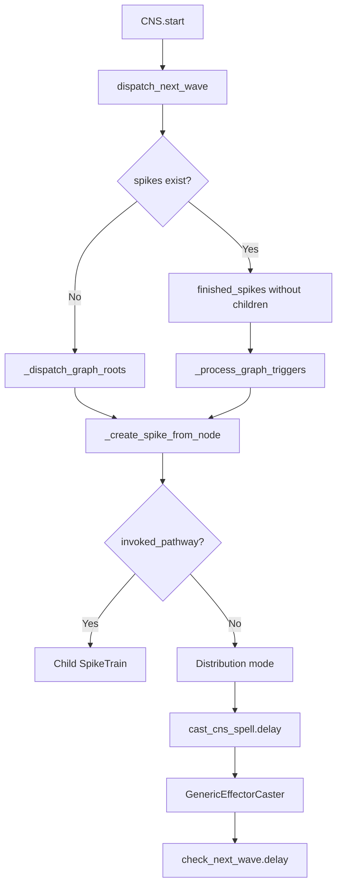
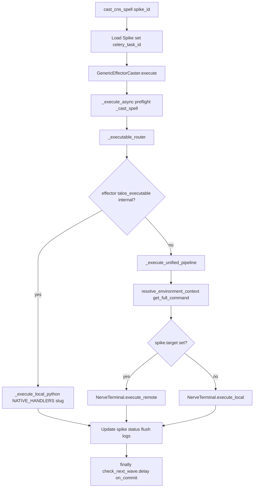
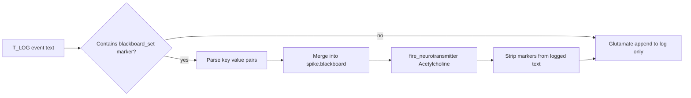

# Central Nervous System — Comprehensive Documentation

## Summary

The **central_nervous_system** module is the live graph engine that launches and monitors build/automation steps. It owns pathways, neurons, axons, effectors, spike trains, spikes, and the Celery-driven dispatch loop.

---

## Table of Contents

1. [Overview](#overview)
2. [Directory / Module Map](#directory--module-map)
3. [Public Interfaces](#public-interfaces)
4. [Execution and Control Flow](#execution-and-control-flow)
5. [Data Flow](#data-flow)
6. [Integration Points](#integration-points)
7. [Configuration and Conventions](#configuration-and-conventions)
8. [Extension and Testing Guidance](#extension-and-testing-guidance)
9. [Visualizations](#visualizations)
10. [Mathematical Framing](#mathematical-framing)

---

## Target: central\_nervous\_system/

### Overview

**Purpose:** The CNS is the live graph engine that launches and monitors build/automation steps. It owns pathways, neurons, axons, effectors, spike trains, spikes, and the Celery-driven dispatch loop.

**Connections in the wider system:**

*   **environments**: Context resolution, variable interpolation, `ProjectEnvironment`
*   **peripheral\_nervous\_system**: `NerveTerminal` for local/remote execution
*   **frontal\_lobe**: Native handler `run_frontal_lobe` for reasoning spikes
*   **temporal\_lobe**: Native handler `run_temporal_lobe` for scheduler spikes
*   **synaptic\_cleft**: Websocket events (Glutamate, Dopamine, Cortisol, Acetylcholine)
*   **thalamus**: Dedicated `NeuralPathway.THALAMUS` pathway and standing `SpikeTrain` for the UI chat bubble; `cast_cns_spell` continues execution after human reply (`thalamus.thalamus.inject_human_reply`)

***

### Directory / Module Map

```
central_nervous_system/
├── __init__.py
├── admin.py
├── api.py, api_v2.py
├── central_nervous_system.py   # CNS class, dispatch logic
├── cns_graph.py                # Graph editor API, launch views
├── constants.py
├── models.py                   # NeuralPathway, Neuron, Axon, Spike, SpikeTrain, Effector
├── serializers.py, serializers_v2.py
├── signals.py                  # spawn_success, spawn_failed
├── tasks.py                    # cast_cns_spell, check_next_wave
├── utils.py                    # resolve_environment_context, get_active_environment
├── urls/, views/
├── effectors/
│   └── effector_casters/
│       ├── generic_effector_caster.py
│       ├── begin_play_node.py
│       ├── pathway_logic_node.py
│       └── effector_handlers/
└── tests/
```

**Grouping by responsibility:**

*   **Engine:** `central_nervous_system.py`, `tasks.py`
*   **Models:** `models.py`
*   **Context:** `utils.py`
*   **Execution:** `effectors/effector_casters/generic_effector_caster.py`
*   **Graph API:** `cns_graph.py`

***

### Public Interfaces

| Interface                                                       | Type        | Purpose                                                                                      |
| --------------------------------------------------------------- | ----------- | -------------------------------------------------------------------------------------------- |
| `CNS`                                                           | Class       | Graph dispatcher;`start()`,`terminate()`,`stop_gracefully()`,`poll()`,`dispatch_next_wave()` |
| `cast_cns_spell`                                                | Celery task | Executes one Spike via GenericEffectorCaster                                                 |
| `check_next_wave`                                               | Celery task | Advances graph after spike completion                                                        |
| `resolve_environment_context(spike_id)`                         | Function    | Builds context dict with precedence: metadata < env < blackboard < effector < neuron         |
| `NeuralPathway`,`Neuron`,`Axon`,`Effector`,`Spike`,`SpikeTrain` | Models      | Graph and runtime entities;`NeuralPathway.THALAMUS`reserved for thalamus UI standing train   |
| `CNSGraphLaunchAPI`,`CNSGraphAPI`                               | Views       | Launch and edit pathways                                                                     |


***

### Execution and Control Flow

1.  **Launch:** `CNS(pathway_id).start()` or `CNS(spike_train_id).start()` → `dispatch_next_wave()`
2.  **Root dispatch:** If no spikes exist, `_dispatch_graph_roots()` creates spikes for `is_root=True` neurons
3.  **Trigger dispatch:** For each finished spike (SUCCESS/FAILED) without children, `_process_graph_triggers()` follows enabled axons
4.  **Spike creation:** `_create_spike_from_node()` → distribution mode → `cast_cns_spell.delay(spike_id)`
5.  **Celery:** `cast_cns_spell` runs `GenericEffectorCaster.execute()`; in `finally`, calls `check_next_wave.delay(spike_train_id)`
6.  **Subgraph:** If neuron has `invoked_pathway`, child `SpikeTrain` is created; parent spike → DELEGATED

***

### Data Flow

```
SpikeTrain (pathway, environment)
    → Spike (neuron, effector, provenance, blackboard)
    → GenericEffectorCaster
    → resolve_environment_context → full_cmd
    → NerveTerminal (local/remote) OR native handler
    → AsyncLogManager → DB + synaptic_cleft
    → Spike.status = SUCCESS|FAILED
    → check_next_wave → dispatch_next_wave
```

**Blackboard propagation:** Child spike copies parent's `blackboard`; subgraph child also overlays parent neuron's `NeuronContext`.

***

### Integration Points

| Consumer                      | Usage                                                                |
| ----------------------------- | -------------------------------------------------------------------- |
| `dashboard`                   | Launch pathways, poll status                                         |
| `GenericEffectorCaster`       | `resolve_environment_context`,`get_active_environment`               |
| `Effector.get_full_command()` | Uses`VariableRenderer`with context from`resolve_environment_context` |
| `synaptic_cleft`              | \`fire\_neurotransmitter(Glutamate                                   |
| `temporal_lobe`               | `run_temporal_lobe`native handler                                    |


***

### Configuration and Conventions

*   **Stale pending timeout:** 5 minutes (`STALE_PENDING_TIMEOUT`)
*   **Distribution modes:** LOCAL\_SERVER, ALL\_ONLINE\_AGENTS, ONE\_AVAILABLE\_AGENT, SPECIFIC\_TARGETS
*   **Axon types:** flow (1), success (2), failure (3)

***

### Extension and Testing Guidance

**Extension points:**

*   Add native handlers in `NATIVE_HANDLERS` (generic\_effector\_caster.py)
*   Add new distribution modes in `CNSDistributionModeID`
*   Extend `resolve_environment_context` for new context sources

**Tests:** `central_nervous_system/tests/`, `effectors/effector_casters/tests/`

***

## Visualizations

### Graph Dispatch Flow



### `cast_cns_spell` and effector routing

Celery loads the spike, runs `GenericEffectorCaster.execute()`, then always schedules `check_next_wave` on commit.



### Log stream to blackboard and Acetylcholine

When subprocess output contains `::blackboard_set`, the caster updates `Spike.blackboard` and mirrors to the UI bus.



***

## Mathematical Framing

### Static Graph

Let $G = (V, E, \lambda)$ where:

*   $V$ = set of Neurons (nodes)
*   $E \subseteq V \times V$ = set of Axons (directed edges)
*   $\lambda : E \to \{\text{flow}, \text{success}, \text{failure}\}$ = edge label function

$$
\lambda(e) \in \{1, 2, 3\} \quad \text{with} \quad 1=\text{flow},\; 2=\text{success},\; 3=\text{failure}
$$

### Spike Status and Transition Rule

Let $\sigma(s)$ denote the terminal status of spike $s$:

$$
\sigma(s) \in \{\text{SUCCESS}, \text{FAILED}\}
$$

Define the **enabled edge labels** for a finished spike $s$:

$$
L_{\text{enabled}}(s) = \{\text{flow}\} \cup \begin{cases}
\{\text{success}\} & \text{if } \sigma(s) = \text{SUCCESS} \\
\{\text{failure}\} & \text{if } \sigma(s) = \text{FAILED}
\end{cases}
$$

**Transition rule:** For each outgoing edge $e = (\nu(s), v)$ with $\lambda(e) \in L_{\text{enabled}}(s)$, create a new runtime spike at $v$.

### Wave Dispatch Semantics

*   **Roots:** Neurons with `is_root=True` start the first wave.
*   **Trigger guard:** A finished spike is processed only if it has no descendants (`spike.id \notin \text{parents\_with\_children}`).
*   **Finalization:** When no active spikes remain, `SpikeTrain.status` → SUCCESS or STOPPED.

### Blackboard Propagation

For spike $s'$ with provenance $s$:

$$
\mathcal{B}(s') = \mathcal{B}(s) \quad \text{(copy)}
$$

For child `SpikeTrain` from delegated spike $s$:

$$
\mathcal{B}(s') = \mathcal{B}(s) \oplus \text{NeuronContext}(\nu(s))
$$

where $\oplus$ denotes dictionary update (right side wins).

### Context Resolution Precedence

As implemented in `resolve_environment_context`:

$$
C = \text{metadata} \oplus \text{env} \oplus \text{blackboard} \oplus \text{effector} \oplus \text{neuron}
$$

Rightmost wins: $\text{neuron} > \text{effector} > \text{blackboard} > \text{env} > \text{metadata}$.

### Distribution Cardinality

Let $n_{\text{online}}$ = count of online agents, $n_{\text{targets}}$ = count of pinned targets. For a logical transition at node $v$:

| Mode                  | Cardinality                            |
| --------------------- | -------------------------------------- |
| LOCAL\_SERVER         | 1                                      |
| ONE\_AVAILABLE\_AGENT | 1 if$n_{\text{online}} > 0$, else fail |
| ALL\_ONLINE\_AGENTS   | $n_{\text{online}}$                    |
| SPECIFIC\_TARGETS     | $n_{\text{targets}}$                   |


### Hierarchical Composition

If neuron $\nu$ has `invoked_pathway` $P'$:

*   Parent spike → DELEGATED
*   Child `SpikeTrain` created with `pathway=P'`, `parent_spike=s`
*   Child terminal status maps back to parent via signals

### Invariants (from code)

1.  **Single root:** At most one Begin Play neuron per pathway (enforced in graph editor).
2.  **Terminal states:** Spike: SUCCESS, FAILED, ABORTED, STOPPED. SpikeTrain: SUCCESS, FAILED, STOPPED.
3.  **Self-driving loop:** `cast_cns_spell` always calls `check_next_wave` in `finally`.

### Assumptions

*   The graph is not guaranteed acyclic; retrigger prevention is via "already has descendants" check.
*   Stale pending spikes (> 5 min) are marked FAILED by `poll()`.
