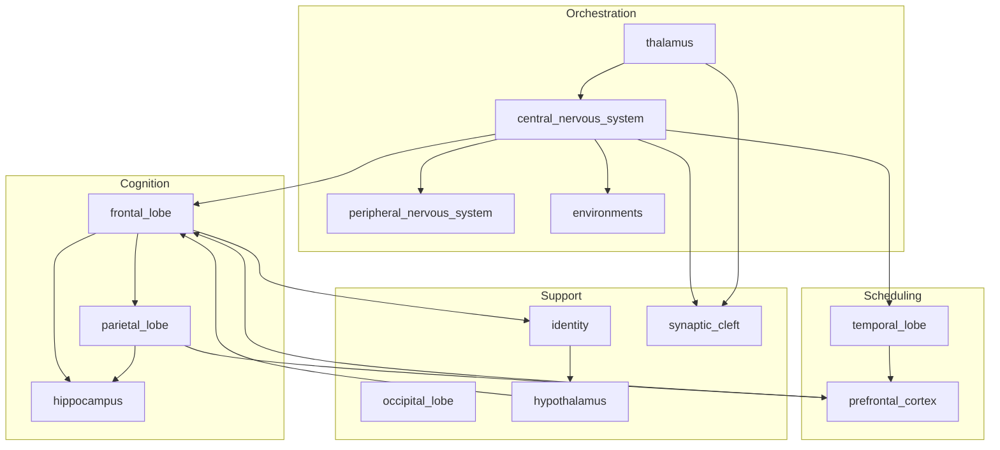
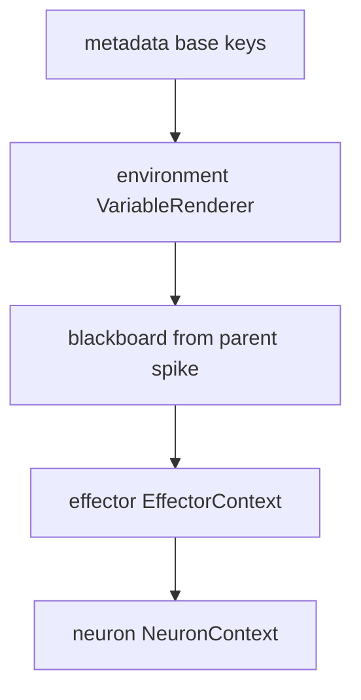

# Talos — Combined Architecture Documentation

## Summary

Combined architectural documentation for all Talos modules: orchestration, cognition, scheduling, and support layers. Cross-module relationships, unified mathematical objects, economy systems, and state machines.

---

## Table of Contents

1. [Cross-Module Architecture](#cross-module-architecture)
2. [Unified Mathematical Objects](#unified-mathematical-objects)
3. [Context Resolution Precedence](#context-resolution-precedence)
4. [Economy Systems](#economy-systems)
5. [State Machines](#state-machines)
6. [Invariants and Assumptions](#invariants-and-assumptions)
7. [Module Index](#module-index)
8. [Saved Files](#saved-files)

---

## Cross-Module Architecture

***

## Unified Mathematical Objects

### 1. CNS Graph

$G = (V, E, \lambda)$

*   $V$ = Neurons
*   $E \subseteq V \times V$ = Axons
*   $\lambda(e) \in \{\text{flow}, \text{success}, \text{failure}\}$

**Transition rule:** For finished spike $s$ with $\sigma(s) \in \{\text{SUCCESS}, \text{FAILED}\}$:

$$
L_{\text{enabled}}(s) = \{\text{flow}\} \cup \begin{cases} \{\text{success}\} & \sigma(s)=\text{SUCCESS} \\ \{\text{failure}\} & \sigma(s)=\text{FAILED} \end{cases}
$$

For each $e = (\nu(s), v)$ with $\lambda(e) \in L_{\text{enabled}}(s)$: create spike at $v$.

### 2. Context Composition

$$
C = \text{metadata} \oplus \text{env} \oplus \text{blackboard} \oplus \text{effector} \oplus \text{neuron}
$$

**Precedence (rightmost wins):** neuron > effector > blackboard > env > metadata.

### 3. Hippocampus Vector Space

*   Embedding: $\phi : \mathcal{T} \to \mathbb{R}^{768}$
*   Similarity: $\text{sim}(\mathbf{a}, \mathbf{b}) = 1 - d_{\cos}(\mathbf{a}, \mathbf{b})$
*   Intercept: $\text{max\_sim} \geq 0.90 \Rightarrow$ save rejected
*   Novelty: $\text{novelty} = \max(0, 1 - \text{similarity})$
*   Rewards: $\text{focus\_yield} = \max(1, \lfloor 10 \cdot \text{novelty} \rfloor)$, $\text{xp\_yield} = \max(5, \lfloor 100 \cdot \text{novelty} \rfloor)$

### 4. Session Economy (Frontal Lobe)

$$
\text{current\_level} = \lfloor \text{total\_xp} / 100 \rfloor + 1
$$

$$
\text{max\_focus} = 10 + \lfloor (\text{current\_level} - 1) \cdot 0.5 \rfloor
$$

**Efficiency bonus:** If $\text{len}(\text{thought\_process}) \leq \text{current\_level} \cdot 1000$: +1 focus, +5 XP.

### 5. Tool Economy (Parietal Lobe)

**Fizzle:** $\Delta f < 0 \land f + \Delta f < 0 \Rightarrow$ tool not executed.

**Update:** $f' = \min(\text{max\_focus}, f + \Delta f)$; $\text{total\_xp}' = \text{total\_xp} + \text{xp\_gain}$.

**Scheduling:** Tool calls sorted by $\text{focus\_modifier}$ descending.

### 6. PFC Work Graph

$$
\mathcal{G}_{\text{PFC}} = (\mathcal{E} \cup \mathcal{S} \cup \mathcal{T}, R_{\text{epic}}, R_{\text{story}})
$$

Work-eligibility $W(\text{shift}, \text{identity\_type}, \text{disc}, \text{env})$ is a finite table (Shift × IdentityType → predicate).

### 7. Temporal Iteration State Machine

$$
\text{WAITING} \to \text{RUNNING} \to \text{FINISHED}
$$

Participant: SELECTED → ACTIVATED → COMPLETED (or stand-down: ACTIVATED → SELECTED).

### 8. Synaptic Event Taxonomy

$$
\mathcal{E}_{\text{synapse}} = \{\text{LOG}, \text{STATUS}, \text{BLACKBOARD}\}
$$

Channels: `fire_neurotransmitter` routes to `synapse_{receptor_class}` (lowercase class name), e.g. CNS log traffic vs `thalamus.signals` entity updates.

### 9. Occipital Log Budget

$$
\text{max\_char\_limit} = (\text{max\_token\_budget} - 2000) \times 4
$$

Error blocks: 5 lines before, 10 after; max 5 blocks.

### 10. Hypothalamus Model Routing

*   Persona and catalog embeddings: $\mathbf{v}_p, \mathbf{v}_m \in \mathbb{R}^{768}$ (`IdentityDisc.vector`, `AIModel.vector`).
*   **Routing:** Among feasible `AIModelProvider` rows (chat mode, enabled model, current pricing, budget cap, context $\geq$ payload estimate, circuit breaker open), choose

$$
r^\* = \arg\min \left( d_{\cos}(\mathbf{v}_{m(r)}, \mathbf{v}_p),\ c^{\text{in}}_r \right)
$$

lexicographically (cosine distance first, then input cost per token).

***

## Context Resolution Precedence

| Layer | Source                                    | Overrides  |
| ----- | ----------------------------------------- | ---------- |
| 1     | metadata (spike\_id, pathway\_id, etc.)   | —          |
| 2     | env (VariableRenderer.extract\_variables) | metadata   |
| 3     | blackboard (Spike.blackboard)             | env        |
| 4     | effector (EffectorContext)                | blackboard |
| 5     | neuron (NeuronContext)                    | effector   |

**Implementation:** `central_nervous_system.utils.resolve_environment_context`

### Context precedence stack

Later layers in the merge win over earlier ones (neuron wins over effector, and so on).

***

## Economy Systems

| System      | Resource     | Update Rule                                                             |
| ----------- | ------------ | ----------------------------------------------------------------------- |
| Session     | focus        | $\min(\text{max\_focus}, f + \Delta f)$; fizzle if$f + \Delta f < 0$    |
| Session     | XP           | $\text{total\_xp} + \text{xp\_gain}$                                    |
| Level       | —            | $\lfloor \text{total\_xp} / 100 \rfloor + 1$                            |
| Hippocampus | focus\_yield | $\max(1, \lfloor 10 \cdot \text{novelty} \rfloor)$when not intercepted  |
| Hippocampus | xp\_yield    | $\max(5, \lfloor 100 \cdot \text{novelty} \rfloor)$when not intercepted |

***

## State Machines

| Entity                    | States                                                                              | Terminal                              |
| ------------------------- | ----------------------------------------------------------------------------------- | ------------------------------------- |
| Spike                     | CREATED, PENDING, RUNNING, SUCCESS, FAILED, ABORTED, DELEGATED, STOPPING, STOPPED   | SUCCESS, FAILED, ABORTED, STOPPED     |
| SpikeTrain                | CREATED, RUNNING, SUCCESS, FAILED, STOPPING, STOPPED                                | SUCCESS, FAILED, STOPPED              |
| ReasoningSession          | PENDING, ACTIVE, PAUSED, COMPLETED, MAXED\_OUT, ERROR, ATTENTION\_REQUIRED, STOPPED | COMPLETED, MAXED\_OUT, ERROR, STOPPED |
| Iteration                 | WAITING, RUNNING, FINISHED, CANCELLED, BLOCKED\_BY\_USER, ERROR                     | FINISHED, etc.                        |
| IterationShiftParticipant | SELECTED, ACTIVATED, COMPLETED, PAUSED, ERROR                                       | COMPLETED, etc.                       |

***

## Invariants and Assumptions

### Invariants (Verified from Code)

1.  **CNS:** At most one Begin Play neuron per pathway; `cast_cns_spell` always calls `check_next_wave` in finally.
2.  **Environments:** At most one ProjectEnvironment with selected=True.
3.  **Hippocampus:** Vector dim = 768; intercept threshold = 0.90.
4.  **PFC:** No ReasoningSession without `_is_available_work` True.
5.  **Temporal:** At most one active temporal SpikeTrain per environment.
6.  **Synaptic:** All neurotransmitters inherit Neurotransmitter (Pydantic).

### Assumptions

1.  **CNS:** Graph may have cycles; retrigger prevention via "has descendants" check.
2.  **Hippocampus:** Embeddings sufficiently normalized for cosine distance.
3.  **Frontal:** Prompt-window heuristic (`num_ctx = floor(payload_size/3) + 2048`) not tokenizer-accurate.
4.  **Occipital:** 1 token ≈ 4 chars.

***

## Module Index

| Module                      | Key Mathematical Structure                                                                                         |
| --------------------------- | ------------------------------------------------------------------------------------------------------------------ |
| central\_nervous\_system    | $G=(V,E,\lambda)$,$L_{\text{enabled}}(s)$, blackboard propagation, context precedence                              |
| frontal\_lobe               | Session level, max\_focus; addon-composed payloads; tool-arg pruning via`prune_after_turns`; hypothalamus hot-swap |
| parietal\_lobe              | Tool schema cost/reward, fizzle condition, focus/XP update                                                         |
| prefrontal\_cortex          | Work graph$\mathcal{G}_{\text{PFC}}$,$W(\text{shift}, \text{type}, \ldots)$                                        |
| temporal\_lobe              | Iteration state machine, shift sequence, ghost cleanup, Ouroboros                                                  |
| hippocampus                 | $\phi$, cosine similarity, intercept, novelty, focus\_yield, xp\_yield                                             |
| identity                    | Addon composition, AddonPackage, ADDON\_REGISTRY                                                                   |
| synaptic\_cleft             | Event taxonomy$\mathcal{E}$, group routing$G(s)$                                                                   |
| peripheral\_nervous\_system | Discovery protocol, NerveTerminalEvent, unified local/remote                                                       |
| environments                | Single selection, extract/render, context merge                                                                    |
| occipital\_lobe             | Error block extraction, token budget, truncation                                                                   |
| hypothalamus                | Cosine routing$d_{\cos}(\mathbf{v}_m, \mathbf{v}_p)$, budget/pricing feasibility, LiteLLM sync                     |
| thalamus                    | Standing`NeuralPathway.THALAMUS`train,`inject_human_reply`→`cast_cns_spell`, signal broadcast                      |

***

## Saved Files

*   `docs/doc-generator/central_nervous_system__documentation.md`
*   `docs/doc-generator/frontal_lobe__documentation.md`
*   `docs/doc-generator/parietal_lobe__documentation.md`
*   `docs/doc-generator/prefrontal_cortex__documentation.md`
*   `docs/doc-generator/temporal_lobe__documentation.md`
*   `docs/doc-generator/identity__documentation.md`
*   `docs/doc-generator/synaptic_cleft__documentation.md`
*   `docs/doc-generator/peripheral_nervous_system__documentation.md`
*   `docs/doc-generator/environments__documentation.md`
*   `docs/doc-generator/occipital_lobe__documentation.md`
*   `docs/doc-generator/hippocampus__documentation.md` (pre-existing)
*   `docs/doc-generator/hypothalamus__documentation.md`
*   `docs/doc-generator/thalamus__documentation.md`
*   `docs/doc-generator/combined__documentation.md`
