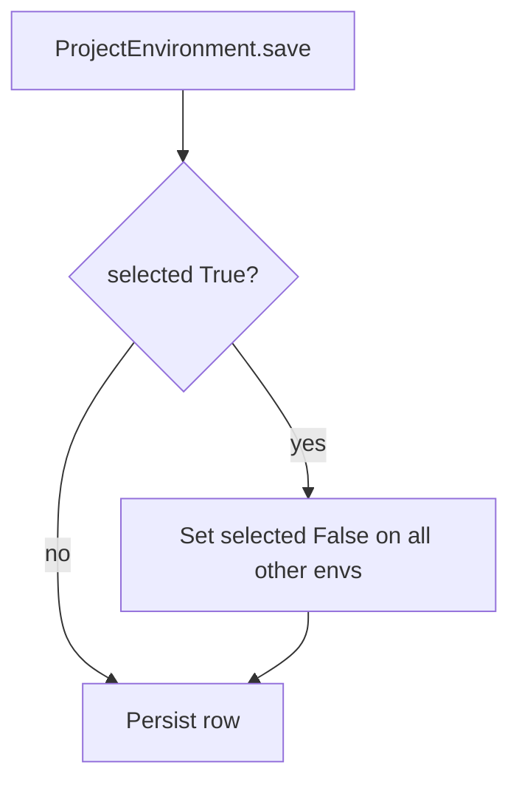
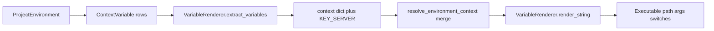

# Environments — Comprehensive Documentation

## Summary

The **environments** module provides the global project context: paths, variables, and executable definitions. The selected environment drives CNS spawn creation and context resolution via `{{ variable_name }}` template interpolation.

---

## Table of Contents

1. [Overview](#overview)
2. [Directory / Module Map](#directory--module-map)
3. [Public Interfaces](#public-interfaces)
4. [Execution and Control Flow](#execution-and-control-flow)
5. [Data Flow](#data-flow)
6. [Integration Points](#integration-points)
7. [Configuration and Conventions](#configuration-and-conventions)
8. [Extension and Testing Guidance](#extension-and-testing-guidance)
9. [Visualizations](#visualizations)
10. [Mathematical Framing](#mathematical-framing)

---

## Target: environments/

### Overview

**Purpose:** Environments provide the global project context: paths, variables, executable definitions. The selected environment drives CNS spawn creation and context resolution. Variable interpolation uses `{{ variable_name }}` syntax.

**Connections in the wider system:**

*   **CNS**: `_create_spawn` uses selected environment; `resolve_environment_context` uses env variables
*   **Effector.get\_full\_command**: Uses VariableRenderer with context
*   **temporal\_lobe**: Iteration links to environment

***

### Directory / Module Map

```
environments/
├── __init__.py
├── admin.py
├── api.py, api_urls.py
├── models.py           # ProjectEnvironment, TalosExecutable, ContextVariable
├── variable_renderer.py # VariableRenderer
├── serializers.py
├── urls.py, views.py
└── tests/
```

***

### Public Interfaces

| Interface                                                       | Type          | Purpose                                                   |
| --------------------------------------------------------------- | ------------- | --------------------------------------------------------- |
| `VariableRenderer.extract_variables(environment)`               | Static method | Returns dict of context variables from ProjectEnvironment |
| `VariableRenderer.render_string(template_string, context_dict)` | Static method | Renders`{{ var }}`with context                            |
| `ProjectEnvironment`                                            | Model         | selected (bool), type, status, context variables          |
| `TalosExecutable.get_rendered_executable(environment)`          | Method        | Interpolates executable path                              |
| `ContextVariable`                                               | Model         | environment, key (ProjectEnvironmentContextKey), value    |


***

### Execution and Control Flow

1.  **Selection:** At most one ProjectEnvironment has `selected=True`; `save()` enforces this
2.  **Extract:** `extract_variables(env)` queries ContextVariable for env, returns {key.name: value}
3.  **Render:** `render_string(s, ctx)` uses Django Template/Context; if no `{{` returns as-is

***

### Data Flow

```
ProjectEnvironment (selected, contexts → ContextVariable)
    → VariableRenderer.extract_variables(env) → {key: value}
    → resolve_environment_context merges env into context
    → VariableRenderer.render_string(template, context)
    → Interpolated strings for executable, args, switches
```

***

### Integration Points

| Consumer                                  | Usage                                                         |
| ----------------------------------------- | ------------------------------------------------------------- |
| `central_nervous_system.utils`            | `get_active_environment`, env in`resolve_environment_context` |
| `Effector.get_full_command`               | `VariableRenderer.extract_variables(env)`,`render_string`     |
| `TalosExecutable.get_rendered_executable` | VariableRenderer with env context                             |


***

### Configuration and Conventions

*   **Single selection:** `ProjectEnvironment.save()` clears `selected` on others when self.selected=True
*   **Template syntax:** Django `{{ variable }}`
*   **KEY\_SERVER:** socket.gethostname() in base context

***

### Extension and Testing Guidance

**Extension points:**

*   Add new context keys via ProjectEnvironmentContextKey
*   Extend VariableRenderer for custom interpolation

**Tests:** `environments/tests/`

***

## Visualizations

### Selection invariant

At most one `ProjectEnvironment` row has `selected=True`; saving one clears others.



### Render path into CNS context

`ContextVariable` rows become a dict; templates interpolate via Django engine when placeholders exist.



***

## Mathematical Framing

### Environment Selection

Let $\mathcal{E}$ be the set of ProjectEnvironments. The selection invariant:

$$
|\{e \in \mathcal{E} \mid e.\text{selected} = \text{True}\}| \leq 1
$$

On save with selected=True: $\forall e' \neq e,\; e'.\text{selected} \leftarrow \text{False}$.

### Variable Extraction

$$
\text{extract}(\text{env}) = \{\text{key.name} \mapsto \text{value} \mid \text{ContextVariable}(\text{environment}=\text{env})\} \cup \{\text{server} \mapsto \text{gethostname}()\}
$$

### Template Rendering

$$
\text{render}(s, C) = \begin{cases}
s & \text{if } \text{``{{''}} \notin s \\
\text{Template}(s).\text{render}(\text{Context}(C)) & \text{otherwise}
\end{cases}
$$

Fallback on error: return $s$ unchanged.

### Context Precedence (in resolve\_environment\_context)

Environment variables are merged at a specific position in the full context:

$$
C = \text{metadata} \oplus \text{extract}(\text{env}) \oplus \text{blackboard} \oplus \text{effector} \oplus \text{neuron}
$$

So env is overridden by blackboard, effector, and neuron.

### Invariants (from code)

1.  **Single selection:** Enforced in ProjectEnvironment.save().
2.  **Safe render:** VariableRenderer returns original string on template error.
