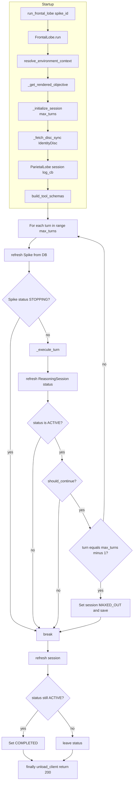
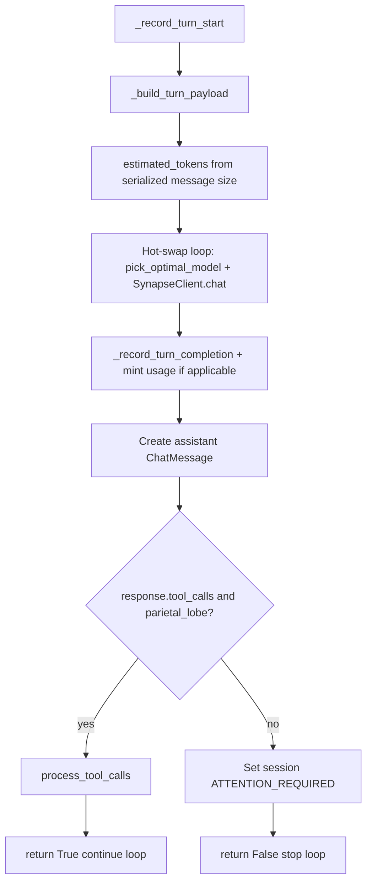
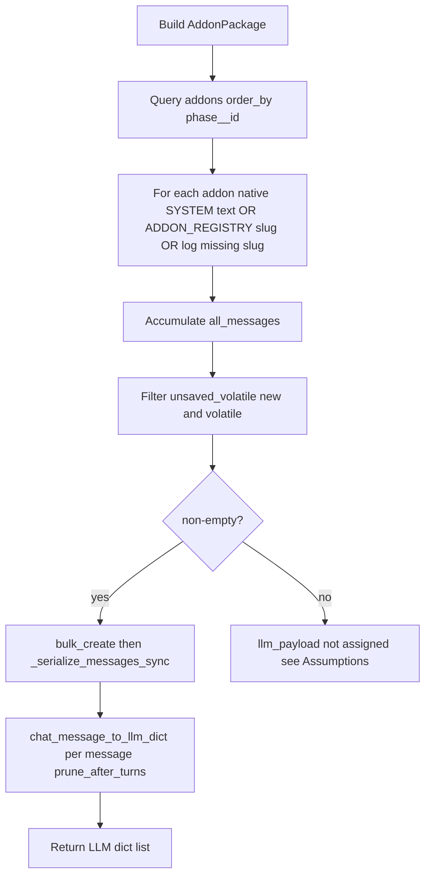
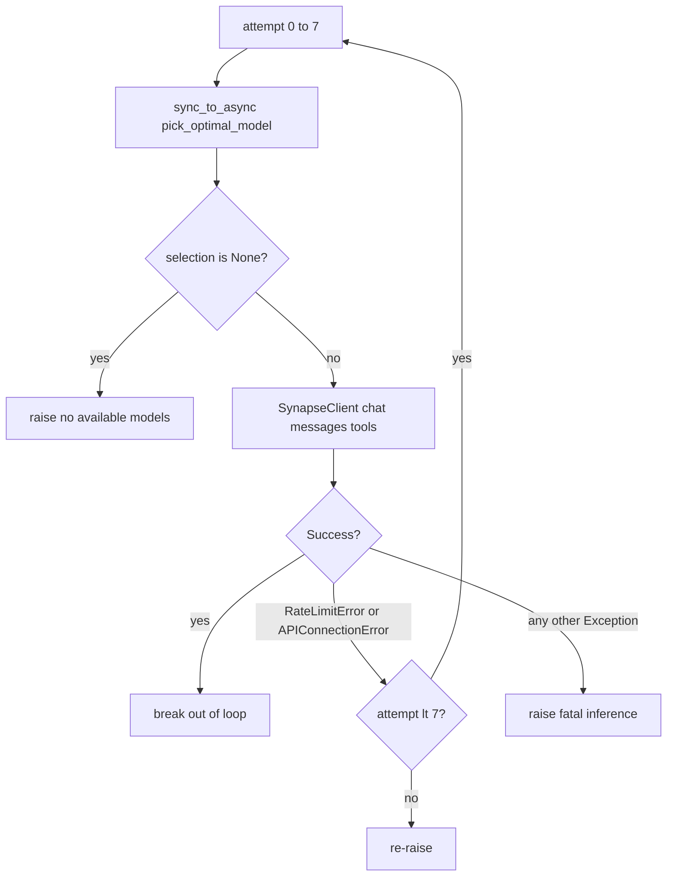
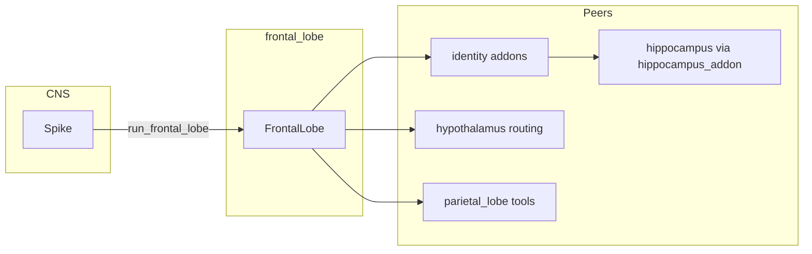

# Frontal Lobe — Comprehensive Documentation

## Summary

The **frontal_lobe** module is the reasoning engine that staffs identity-driven AI workers, gives them tools, and runs the turn loop. Each turn assembles LLM messages via ordered identity addons and routes inference through the hypothalamus hot-swap loop. Session state includes a game-like focus/XP economy with level and efficiency bonuses.

---

## Table of Contents

1.  [Overview](#overview)
2.  [Directory / Module Map](#directory--module-map)
3.  [Public Interfaces](#public-interfaces)
4.  [Execution and Control Flow](#execution-and-control-flow)
5.  [Data Flow](#data-flow)
6.  [Integration Points](#integration-points)
7.  [Configuration and Conventions](#configuration-and-conventions)
8.  [Extension and Testing Guidance](#extension-and-testing-guidance)
9.  [Visualizations](#visualizations)
10. [Mathematical Framing](#mathematical-framing)

***

## Target: frontal\_lobe/

### Overview

**Purpose:** The frontal lobe is the reasoning engine that staffs identity-driven AI workers, gives them tools, and runs the turn loop. Each turn’s LLM messages are assembled in `_build_turn_payload`: identity **addons** (ordered by `IdentityAddonPhase`) produce `ChatMessage` rows—typically `identity_info_addon` (system prompt via `build_identity_prompt`), `normal_chat_addon` (non-volatile history), **CONTEXT** addons such as `hippocampus_addon`, and `focus_addon` (applies `ReasoningTurn.apply_efficiency_bonus()` then injects focus stats). Messages are serialized with `chat_message_to_llm_dict`, which applies tool-argument pruning by age vs `ToolParameter.prune_after_turns`.

**Connections in the wider system:**

*   **central\_nervous\_system**: Invoked via `run_frontal_lobe` native handler
*   **parietal\_lobe**: Tool schemas, `chat()`, `process_tool_calls()`
*   **identity**: `IdentityDisc`, `ADDON_REGISTRY` addons, `AddonPackage`; `build_identity_prompt` is used inside `identity_info_addon`, not as a direct `FrontalLobe` call
*   **hippocampus**: Engram catalog text via `identity.addons.hippocampus_addon` (`TalosHippocampus.get_turn_1_catalog` / `get_recent_catalog`) as volatile user messages
*   **hypothalamus**: `Hypothalamus().pick_optimal_model` + `ModelSelection` → `SynapseClient`
*   **temporal\_lobe**: `IterationShiftParticipant` for session context

***

### Directory / Module Map

```
frontal_lobe/
├── __init__.py
├── admin.py
├── api.py, api_urls.py
├── constants.py
├── frontal_lobe.py      # FrontalLobe class, run(), turn loop
├── models.py           # ReasoningSession, ReasoningTurn, ChatMessage, ModelRegistry
├── synapse.py          # OllamaClient
├── synapse_open_router.py
├── synapse_client.py   # SynapseClient(model_selection)
├── serializers.py
├── urls.py, views.py
└── tests/
```

***

### Public Interfaces

| Interface                           | Type           | Purpose                                                                                         |
| ----------------------------------- | -------------- | ----------------------------------------------------------------------------------------------- |
| `run_frontal_lobe(spike_id)`        | Async function | Entry point for GenericEffectorCaster                                                           |
| `FrontalLobe`                       | Class          | `run()`,`_execute_turn()`,`_build_turn_payload()`                                               |
| `ReasoningSession`                  | Model          | Session state,`current_level`,`max_focus`,`total_xp`                                            |
| `ReasoningTurn`                     | Model          | `apply_efficiency_bonus()`,`was_efficient_last_turn`                                            |
| `Hypothalamus().pick_optimal_model` | Callable       | Chooses`AIModelProvider`by persona vector, budget, context; used in`_execute_turn`hot-swap loop |
| `SynapseClient(model_selection)`    | Class          | Chat client bound to routed LiteLLM id                                                          |


***

### Execution and Control Flow

1.  **Entry:** `run_frontal_lobe(spike_id)` → `FrontalLobe(spike).run()`
2.  **Init:** `resolve_environment_context` → objective, max\_turns; create `ReasoningSession`
3.  **Parietal:** `ParietalLobe.initialize_client(identity_disc)`, `build_tool_schemas()`
4.  **Turn loop:** For each turn: `_record_turn_start` → `_build_turn_payload` (addons; may include `focus_addon` → `apply_efficiency_bonus`) → `pick_optimal_model`\*\* + **`SynapseClient.chat`** (up to 8 failovers on rate limit / connection errors)\*\* → `process_tool_calls` or yield (`ATTENTION_REQUIRED` when no tools)
5.  **Exit:** Session status → COMPLETED, MAXED\_OUT, or ERROR

See [Visualizations](#visualizations) for flowcharts of `run()`, `_execute_turn`, addons, and hot-swap.

***

### Data Flow

```
Spike → resolve_environment_context → objective, max_turns
    → ReasoningSession (identity_disc, participant, spike)
    → _build_turn_payload: AddonPackage → ordered addons → list[ChatMessage]
       (identity_info + normal_chat + hippocampus + focus + …)
    → bulk_create volatile messages → _serialize_messages_sync → chat_message_to_llm_dict
    → pick_optimal_model → SynapseClient.chat (ParietalLobe.chat)
    → ToolCall → ParietalMCP.execute
    → Session: current_focus, total_xp updated (when focus_addon / parietal tools run)
```

***

### Integration Points

| Consumer                | Usage                                                                                                             |
| ----------------------- | ----------------------------------------------------------------------------------------------------------------- |
| `GenericEffectorCaster` | `run_frontal_lobe`native handler                                                                                  |
| `PrefrontalCortex`      | Creates ReasoningSession, calls`FrontalLobe.run()`                                                                |
| `hypothalamus`          | `pick_optimal_model`,`ModelSelection`                                                                             |
| `identity`              | `ADDON_REGISTRY`addons,`AddonPackage`;`hippocampus_addon`/`identity_info_addon`/`normal_chat_addon`/`focus_addon` |


***

### Configuration and Conventions

*   **Default max\_turns:** From `FrontalLobeConstants.DEFAULT_MAX_TURNS`
*   **History:** Typically `normal_chat_addon` (full non-volatile thread); long threads rely on tool `prune_after_turns` and model context limits
*   **Session status:** PENDING, ACTIVE, PAUSED, COMPLETED, MAXED\_OUT, ERROR, ATTENTION\_REQUIRED, STOPPED

***

### Extension and Testing Guidance

**Extension points:**

*   Add new addons via `identity.addons.addon_registry` (`Callable[[AddonPackage], List[ChatMessage]]`)
*   Extend hippocampus catalog behavior via `identity.addons.hippocampus_addon` / `TalosHippocampus`
*   Adjust history strategy in `normal_chat_addon` or tool pruning via `ToolParameter.prune_after_turns` in `chat_message_to_llm_dict`

**Tests:** `frontal_lobe/tests/`

***

## Visualizations

### `FrontalLobe.run()` lifecycle

Startup resolves context and tools; the turn loop stops early on `Spike` STOPPING, non-`ACTIVE` session, or `should_continue == False`. After the loop, an still-`ACTIVE` session is marked `COMPLETED`. Errors set `ERROR` and return 500. `finally` always calls `unload_client`.



### Single turn: `_execute_turn`

After inference succeeds, tool calls go to Parietal; otherwise the session yields to the user with `ATTENTION_REQUIRED`.



### Addon pipeline: `_build_turn_payload`

`llm_payload` is built only inside `if unsaved_volatile` after `bulk_create`; typical stacks include at least one addon that emits **new volatile** messages each turn (e.g. `identity_info_addon`).



### Hypothalamus hot-swap loop

Up to **8** attempts (`MAX_FAILOVERS`). Only `RateLimitError` and `APIConnectionError` trigger retry; other exceptions abort immediately.



### Integration context

How `FrontalLobe` sits between CNS and peer apps.



***

## Mathematical Framing

### Session Level and Focus Cap

$$
\text{current\_level} = \lfloor \text{total\_xp} / 100 \rfloor + 1
$$

$$
\text{max\_focus} = 10 + \lfloor (\text{current\_level} - 1) \cdot 0.5 \rfloor
$$

### Turn Efficiency Rule

Let $t$ be the current turn and $t_{\text{last}}$ the previous turn. Define:

$$
\text{target\_capacity} = \text{current\_level} \cdot 1000
$$

$$
\text{was\_efficient} \Leftrightarrow \text{len}(\text{last\_turn.thought\_process}) \leq \text{target\_capacity}
$$

If efficient:

$$
\text{current\_focus} \leftarrow \min(\text{max\_focus}, \text{current\_focus} + 1)
$$

$$
\text{total\_xp} \leftarrow \text{total\_xp} + 5
$$

### Prompt Assembly Order

**Addon order** is determined by `IdentityAddonPhase` on each `IdentityAddon` row. Typical stack:

1.  **IDENTIFY:** `identity_info_addon` → system message from `build_identity_prompt`
2.  **CONTEXT / telemetry:** e.g. `hippocampus_addon`, `telemetry_addon`, etc.
3.  **HISTORY:** `normal_chat_addon` loads all non-volatile `ChatMessage` rows for the session in chronological order (full history; no L1/L2 tiering in that addon today)
4.  **TERMINAL:** e.g. `your_move_addon` if configured

**Inference:** After `_build_turn_payload` produces the LLM dict list, `Hypothalamus.pick_optimal_model` → `SynapseClient.chat`.

### Tool argument pruning (assistant messages)

In `chat_message_to_llm_dict`, for each `ToolCall` on assistant messages, parameters may be replaced with `[PRUNED TO SAVE TOKENS]` when $\text{age} = \text{current\_turn} - \text{message.turn} \geq \text{prune\_after\_turns}$ for that parameter assignment—this replaces the older fixed L1/L2 narrative for tool arguments.

### Invariants (from code)

1.  **Identity required:** `identity_disc` must be set before `run()`; chat models are chosen at runtime via **hypothalamus** (not `IdentityDisc.ai_model()`, which is not used for selection).
2.  **Session linkage:** ReasoningSession links to `spike` and optionally `participant` (IterationShiftParticipant).

### Assumptions

*   Prompt-window heuristic in synapse: `num_ctx = floor(payload_size / 3) + 2048` (not tokenizer-accurate).
*   `_build_turn_payload` only assigns `llm_payload` inside `if unsaved_volatile`; turns should include addons that create **new volatile** `ChatMessage` rows (e.g. `identity_info_addon` on each turn). If nothing is both new and volatile, serialization may not run—keep addon stacks coherent with this pattern.
