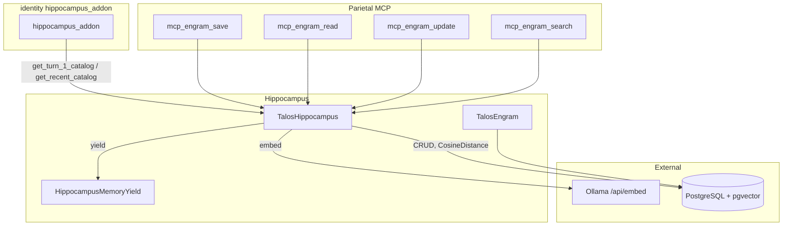
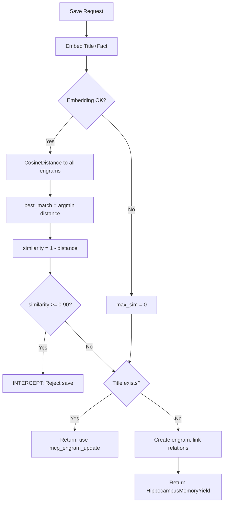
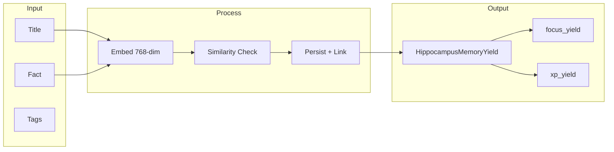

# Hippocampus — Comprehensive Documentation

## Summary

The **hippocampus** module provides permanent storage and retrieval of AI memories (Engrams). Catalog injection for reasoning sessions is performed by the **identity** `hippocampus_addon` (calling `get_turn_1_catalog` / `get_recent_catalog`). Parietal MCP tools (`mcp_engram_save`, `mcp_engram_read`, `mcp_engram_update`, `mcp_engram_search`) invoke `TalosHippocampus` directly.

---

## Table of Contents

1.  [Overview](#overview)
2.  [Directory / Module Map](#directory--module-map)
3.  [Public Interfaces](#public-interfaces)
4.  [Execution and Control Flow](#execution-and-control-flow)
5.  [Data Flow](#data-flow)
6.  [Integration Points](#integration-points)
7.  [Configuration and Conventions](#configuration-and-conventions)
8.  [Extension and Testing Guidance](#extension-and-testing-guidance)
9.  [Visualizations](#visualizations)
10. [Mathematical Framing](#mathematical-framing)

***

## Target: hippocampus/

### Overview

**Purpose:** The hippocampus module provides permanent storage and retrieval of AI memories (Engrams) during reasoning sessions. It acts as the biological analog of long-term memory: facts are crystallized into Engrams, embedded into a vector space, and screened for redundancy before persistence.

**Connections in the wider system:**

*   **identity** (`identity.addons.hippocampus_addon`): CONTEXT-phase addon; Turn 1 → `TalosHippocampus.get_turn_1_catalog(spike)`; Turn 2+ → `get_recent_catalog(session)`; emits volatile `ChatMessage` rows.
*   **Parietal MCP** (`parietal_lobe.parietal_mcp`): Exposes `mcp_engram_save`, `mcp_engram_read`, `mcp_engram_update`, `mcp_engram_search` as tools for the LLM to manage memories.
*   **Ollama** (via `frontal_lobe.synapse.OllamaClient`): Produces 768-dimensional embeddings for similarity screening.
*   **Identity / Spike / ReasoningSession / ReasoningTurn**: Engrams are linked to these entities for provenance and recall.

***

### Directory / Module Map

```
hippocampus/
├── __init__.py
├── admin.py           # Django admin for TalosEngram, TalosEngramTag
├── api.py             # REST ViewSets (TalosEngramViewSet, TalosEngramTagViewSet)
├── api_urls.py        # Router registration for /engrams, /engram_tags
├── apps.py            # HippocampusConfig
├── hippocampus.py    # Core engine: TalosHippocampus, HippocampusMemoryYield
├── models.py          # TalosEngram, TalosEngramTag
├── serializers.py     # DRF serializers
├── views.py           # (empty placeholder)
├── migrations/
│   ├── 0001_initial.py
│   ├── 0002_initial.py
│   └── 0003_talosengram_creator_talosengram_identity_discs.py
└── tests/
    └── test_hippocampus.py   # Vector/intercept and update tests
```

**Grouping by responsibility:**

*   **Engine:** `hippocampus.py` — async memory operations, embedding, similarity logic
*   **Models:** `models.py` — TalosEngram, TalosEngramTag
*   **API:** `api.py`, `api_urls.py`, `serializers.py` — REST endpoints
*   **Admin:** `admin.py` — Django admin configuration

***

### Public Interfaces

| Interface                | Type      | Purpose                                                                                            |
| ------------------------ | --------- | -------------------------------------------------------------------------------------------------- |
| `TalosHippocampus`       | Class     | Async manager for Engram CRUD and catalog retrieval                                                |
| `HippocampusMemoryYield` | Dataclass | Typed result for save/update:`message`,`intercepted`,`similarity`; derived`focus_yield`,`xp_yield` |
| `TalosEngram`            | Model     | Engram entity with vector, sessions, spikes, turns, tags, identity\_discs                          |
| `TalosEngramTag`         | Model     | Tag for categorizing engrams                                                                       |
| `TalosEngramViewSet`     | ViewSet   | REST CRUD for engrams                                                                              |
| `TalosEngramTagViewSet`  | ViewSet   | REST CRUD for tags                                                                                 |


**Key methods:**

*   `TalosHippocampus.get_turn_1_catalog(spike, limit=15)` → `str`: Catalog of Spike-linked engrams for Turn 1.
*   `TalosHippocampus.get_recent_catalog(session)` → `str`: Recent engrams for the session.
*   `TalosHippocampus.save_engram(session_id, title, fact, turn_id, tags='', relevance=1.0)` → `HippocampusMemoryYield`
*   `TalosHippocampus.update_engram(session_id, title, additional_fact, turn_id)` → `HippocampusMemoryYield`
*   `TalosHippocampus.read_engram(session_id, engram_id)` → `str`
*   `TalosHippocampus.search_engrams(query='', tags='', limit=10)` → `str`

***

### Execution and Control Flow

1.  **Catalog injection (hippocampus addon):**

    *   On Turn 1: `TalosHippocampus.get_turn_1_catalog(spike)` → formatted catalog string (volatile user message).
    *   On Turn 2+: `TalosHippocampus.get_recent_catalog(session)` → recent engram list.

2.  **Save flow:**

    *   MCP tool `mcp_engram_save` → `TalosHippocampus.save_engram`.
    *   Embed `Title + Fact` via Ollama `nomic-embed-text`.
    *   Compute cosine distance to all existing engrams; if best similarity $\geq 0.90$, **intercept** (reject save, return existing engram reference).
    *   If title already exists (exact match), return notice to use `mcp_engram_update`.
    *   Otherwise create engram, link session/spike/turn/identity/tags, persist vector.

3.  **Update flow:**

    *   `mcp_engram_update` → `TalosHippocampus.update_engram`.
    *   Fetch existing engram by title; append `[UPDATE]: {additional_fact}` to description.
    *   Re-embed combined text; update vector; maintain all relationship links.

4.  **Read flow:**

    *   `mcp_engram_read` → `TalosHippocampus.read_engram`.
    *   Fetch engram by ID; ensure session/spike/identity links; return formatted fact.

5.  **Search flow:**

    *   `mcp_engram_search` → `TalosHippocampus.search_engrams`.
    *   Full-text search on `name`/`description` (PostgreSQL `SearchVector`/`SearchQuery`) and/or tag filter; return summary list.

***

### Data Flow

```
Input (title, fact, tags, relevance)
    → Embed: text_payload = "Title: {title}\nFact: {fact}"
    → OllamaClient.embed(text_payload) → 768-dim vector
    → CosineDistance to existing vectors
    → Decision: intercept (sim ≥ 0.90) | update (title exists) | create (new)
    → Persist: TalosEngram(name, description, vector, relevance_score)
    → Link: sessions, spikes, source_turns, identity_discs, tags
    → Output: HippocampusMemoryYield(message, intercepted, similarity)
```

**Storage:** PostgreSQL with `pgvector` extension. `TalosEngram.vector` is a `VectorField(dimensions=768)`.

**HippocampusMemoryYield → Parietal Lobe:**

*   `focus_yield`: $\max(1, \lfloor 10 \cdot \text{novelty} \rfloor)$ when not intercepted; 0 when intercepted.
*   `xp_yield`: $\max(5, \lfloor 100 \cdot \text{novelty} \rfloor)$ when not intercepted; 0 when intercepted.
*   \`novelty = \max(0, 1 - \text{similarity})\$.

***

### Integration Points

| Consumer                                       | Usage                                                                         |
| ---------------------------------------------- | ----------------------------------------------------------------------------- |
| `identity.addons.hippocampus_addon`            | Injects catalog block as volatile`ChatMessage`each turn when addon is enabled |
| `parietal_lobe.parietal_mcp.mcp_engram_save`   | Saves new engram                                                              |
| `parietal_lobe.parietal_mcp.mcp_engram_read`   | Reads engram by ID                                                            |
| `parietal_lobe.parietal_mcp.mcp_engram_update` | Updates existing engram                                                       |
| `parietal_lobe.parietal_mcp.mcp_engram_search` | Searches by query/tags                                                        |


**External services:**

*   **Ollama** (`/api/embed`): Produces embeddings for `nomic-embed-text` model.
*   **PostgreSQL + pgvector**: Vector storage and cosine distance queries.

***

### Configuration and Conventions

*   **Embedding model:** `ModelRegistry.NOMIC_EMBED_TEXT` (id=5) for save; `name='nomic-embed-text'` for update (inconsistent lookup style; both resolve to same model).
*   **Vector dimensions:** 768 (fixed; `VectorField(dimensions=768)`).
*   **Intercept threshold:** Similarity $\geq 0.90$ triggers save rejection.
*   **Title length:** Truncated to 254 chars (`clean_title = title[:254]`).
*   **Async pattern:** All DB I/O wrapped in `sync_to_async` for event-loop safety.

***

### Extension and Testing Guidance

**Extension points:**

*   Add new catalog strategies by extending `TalosHippocampus` with additional `get_*_catalog` class methods.
*   Add new similarity thresholds or embedding models via configuration (currently hardcoded).
*   Extend `TalosEngram` relationships (e.g., `tasks` M2M to `PFCTask`) for task-memory linking.

**Tests:** `hippocampus/tests/test_hippocampus.py`

*   `TestHippocampusVectors.test_save_engram_intercepts_identical`: Verifies intercept when similarity is high.
*   `TestHippocampusVectors.test_update_engram_vectors`: Verifies update fetches new embedding and returns correct `focus_yield`/`xp_yield`.

Tests use `@patch` for `ModelRegistry`, `sync_to_async`, and `OllamaClient.embed`; no live DB writes per Talos standards.

***

## Visualizations

### Architecture Diagram



### Save Decision Flow



### Data Flow: Engram Lifecycle



***

## Mathematical Framing

### Vector Space and Embedding

Let $\mathcal{T}$ be the space of text payloads. The embedding function is:

$$
\phi : \mathcal{T} \to \mathbb{R}^{768}, \quad \phi(t) = \mathbf{v}
$$

where $\mathbf{v}$ is produced by Ollama's `nomic-embed-text` model. The payload format is:

$$
t = \texttt{"Title: "} \oplus \texttt{title} \oplus \texttt{"\nFact: "} \oplus \texttt{fact}
$$

### Cosine Distance and Similarity

For vectors $\mathbf{a}, \mathbf{b} \in \mathbb{R}^{768}$, the **cosine distance** (as used by pgvector) is:

$$
d_{\cos}(\mathbf{a}, \mathbf{b}) = 1 - \frac{\mathbf{a} \cdot \mathbf{b}}{\|\mathbf{a}\| \|\mathbf{b}\|} = 1 - \cos\theta
$$

where $\theta$ is the angle between $\mathbf{a}$ and $\mathbf{b}$.

The **similarity** used in the codebase is:

$$
\text{similarity}(\mathbf{a}, \mathbf{b}) = 1 - d_{\cos}(\mathbf{a}, \mathbf{b}) = \frac{\mathbf{a} \cdot \mathbf{b}}{\|\mathbf{a}\| \|\mathbf{b}\|}
$$

### Intercept Condition (Auto-Recall Defense)

On save, let $\mathbf{e}_{\text{new}} = \phi(\texttt{Title: } \oplus \texttt{title} \oplus \texttt{"\nFact: "} \oplus \texttt{fact})$. For each existing engram $i$ with vector $\mathbf{v}_i$:

$$
\text{similarity}_i = 1 - d_{\cos}(\mathbf{v}_i, \mathbf{e}_{\text{new}})
$$

Let $\text{max\_sim} = \max_i \text{similarity}_i$ (or $0$ if no engrams). The **intercept** occurs when:

$$
\text{max\_sim} \geq 0.90 \quad \Rightarrow \quad \text{Save rejected}
$$

### Novelty and Reward Functions

Define **novelty** as:

$$
\text{novelty} = \max(0, 1 - \text{similarity})
$$

When the save is **not** intercepted:

$$
\text{focus\_yield} = \max\left(1, \lfloor 10 \cdot \text{novelty} \rfloor\right)
$$

$$
\text{xp\_yield} = \max\left(5, \lfloor 100 \cdot \text{novelty} \rfloor\right)
$$

When intercepted: $\text{focus\_yield} = 0$, $\text{xp\_yield} = 0$.

### Invariants (from code)

1.  **Vector dimensionality:** $\dim(\mathbf{v}) = 768$ for all stored vectors.
2.  **Similarity range:** $\text{similarity} \in [0, 1]$ (cosine similarity of unit-normalized vectors).
3.  **Intercept threshold:** Fixed at $0.90$; no configuration exposed.
4.  **Novelty bounds:** $\text{novelty} \in [0, 1]$; higher novelty implies more distinct memory.

### Assumptions

*   Embeddings from `nomic-embed-text` are sufficiently normalized for cosine distance to be meaningful.
*   The threshold $0.90$ is a design choice; semantic near-duplicates above this are treated as "already known."
*   Title uniqueness is enforced by name lookup; no hash-based deduplication beyond vector similarity.

***

## Saved Files

*   `docs/doc-generator/hippocampus__documentation.md`
