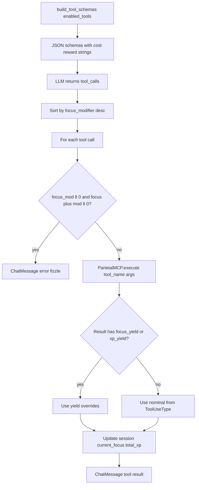
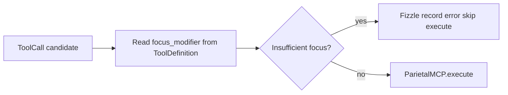

# Parietal Lobe — Comprehensive Documentation

## Summary

The **parietal_lobe** module is the tool bridge between the LLM and Talos. It builds machine-readable JSON schemas from database metadata, executes tool calls via `ParietalMCP`, and applies the focus/XP economy (cost, reward, fizzle). Tool calls are sorted by `focus_modifier` descending.

---

## Table of Contents

1. [Overview](#overview)
2. [Directory / Module Map](#directory--module-map)
3. [Public Interfaces](#public-interfaces)
4. [Execution and Control Flow](#execution-and-control-flow)
5. [Data Flow](#data-flow)
6. [Integration Points](#integration-points)
7. [Configuration and Conventions](#configuration-and-conventions)
8. [Extension and Testing Guidance](#extension-and-testing-guidance)
9. [Visualizations](#visualizations)
10. [Mathematical Framing](#mathematical-framing)

---

## Target: parietal\_lobe/

### Overview

**Purpose:** The parietal lobe translates DB-defined tools into LLM schemas, executes tool calls, and persists results. It enforces the focus economy (fizzle when insufficient focus) and allows tools to override nominal rewards via `focus_yield` and `xp_yield`.

**Connections in the wider system:**

*   **frontal\_lobe**: `ParietalLobe` instantiated by FrontalLobe; `chat()`, `process_tool_calls()`; `SynapseClient` uses **hypothalamus** `ModelSelection`
*   **hippocampus**: `mcp_engram_*` tools
*   **prefrontal\_cortex**: `mcp_ticket` tools (PFCEpic, PFCStory, PFCTask)
*   **identity**: `IdentityDisc.enabled_tools` determines tool availability
*   **hypothalamus**: `ModelSelection` / `AIModelProvider` types shared with frontal synapse client paths

***

### Directory / Module Map

```
parietal_lobe/
├── __init__.py
├── admin.py
├── api.py, api_urls.py
├── models.py           # ToolDefinition, ToolParameter, ToolUseType, ToolCall
├── parietal_lobe.py    # ParietalLobe class
├── parietal_mcp/       # MCP gateway + mcp_* modules
│   ├── gateway.py      # ParietalMCP.execute
│   ├── mcp_engram_*.py
│   ├── mcp_ticket*.py
│   ├── mcp_internal_monologue.py
│   ├── mcp_read_file.py, mcp_grep.py, mcp_fs*.py
│   ├── mcp_git*.py
│   └── ...
├── registry.py
├── tools.py
└── tests/
```

***

### Public Interfaces

| Interface                              | Type     | Purpose                                                                          |
| -------------------------------------- | -------- | -------------------------------------------------------------------------------- |
| `ParietalLobe`                         | Class    | `build_tool_schemas()`,`chat()`,`handle_tool_execution()`,`process_tool_calls()` |
| `ParietalMCP.execute(tool_name, args)` | Function | Dispatches to`mcp_*`module by name                                               |
| `ToolDefinition`,`ToolUseType`         | Models   | Schema source;`focus_modifier`,`xp_reward`                                       |
| `ToolCall`                             | Model    | Execution record per turn                                                        |


***

### Execution and Control Flow

1.  **Schema build:** `build_tool_schemas()` fetches `identity_disc.enabled_tools`, builds JSON schema with cost/reward string
2.  **Tool execution:** `process_tool_calls()` sorts by `focus_modifier` descending, then `handle_tool_execution()` for each
3.  **Fizzle check:** If `focus_mod < 0` and `current_focus + focus_mod < 0` → fizzle, record error
4.  **Execute:** `ParietalMCP.execute(tool_name, args)` → result
5.  **Override:** If result has `focus_yield` or `xp_yield`, use those instead of nominal
6.  **Update:** `session.current_focus`, `session.total_xp`; persist `ChatMessage` with tool result

***

### Data Flow

```
ToolDefinition (assignments → ToolParameter, use_type → ToolUseType)
    → build_tool_schemas() → JSON schema + "[COST: X Focus | REWARD: +Y XP]"
    → LLM tool_calls
    → process_tool_calls (sorted by focus_modifier desc)
    → handle_tool_execution
    → Fizzle? → ChatMessage(error) : ParietalMCP.execute
    → focus_yield, xp_yield override
    → Session update, ChatMessage(result)
```

***

### Integration Points

| Consumer            | Usage                                                                       |
| ------------------- | --------------------------------------------------------------------------- |
| `FrontalLobe`       | `ParietalLobe(session, log_callback)`;`chat()`,`process_tool_calls()`       |
| `hypothalamus`      | `ModelSelection`for routed inference alongside tool loop                    |
| `hippocampus`       | `mcp_engram_save`,`mcp_engram_read`,`mcp_engram_update`,`mcp_engram_search` |
| `prefrontal_cortex` | `mcp_ticket`(create, read, update, search, comment)                         |


***

### Configuration and Conventions

*   **Tool availability:** From `IdentityDisc.enabled_tools`, filtered `is_async=True`
*   **Schema format:** OpenAI/Ollama function-calling spec

***

### Extension and Testing Guidance

**Extension points:**

*   Add new `mcp_*.py` modules; `ParietalMCP` dynamically imports by name
*   Add `ToolUseType` for new cost/reward profiles

**Tests:** `parietal_lobe/tests/`, `parietal_mcp/tests/`

***

## Visualizations

### From schemas to executed tools

`build_tool_schemas` feeds the LLM; `process_tool_calls` walks sorted tool calls through focus checks and MCP execution.



### Focus decision diamond

Compact view of the fizzle gate before execution.



***

## Mathematical Framing

### Tool Schema Construction

For each `ToolDefinition` $t$ with `use_type` $\mu$:

$$
\text{cost\_str} = \begin{cases}
\text{``[COST: } \mu.\text{focus\_modifier} \text{ Focus | REWARD: +} \mu.\text{xp\_reward} \text{ XP] ''} & \text{if } \mu \text{ exists} \\
\text{``[COST: 0 Focus | REWARD: +0 XP] ''} & \text{otherwise}
\end{cases}
$$

$$
\text{full\_description} = \text{cost\_str} \oplus t.\text{description}
$$

### Focus Fizzle Condition

Let $\Delta f = \text{focus\_modifier}$, $f = \text{current\_focus}$. Fizzle occurs when:

$$
\Delta f < 0 \quad \land \quad f + \Delta f < 0
$$

### Focus and XP Update (Non-Fizzle)

$$
f' = \min(\text{max\_focus}, f + \Delta f)
$$

$$
\text{total\_xp}' = \text{total\_xp} + \text{xp\_gain}
$$

Where $\Delta f$ and $\text{xp\_gain}$ may be overridden by tool result attributes `focus_yield` and `xp_yield`.

### Tool Scheduling Heuristic

Tool calls are sorted by $\text{focus\_modifier}$ descending:

$$
\text{sorted\_calls} = \text{sort}(\text{tool\_calls}, \text{key}=\text{get\_focus\_mod}, \text{reverse}=\text{True})
$$

Rationale: Execute beneficial or zero-cost tools first to reduce fizzle risk.

### Invariants (from code)

1.  **Tool existence:** Unknown tools return error and are recorded in history.
2.  **ChatMessage persistence:** Tool results are always saved with `is_volatile=False`.
