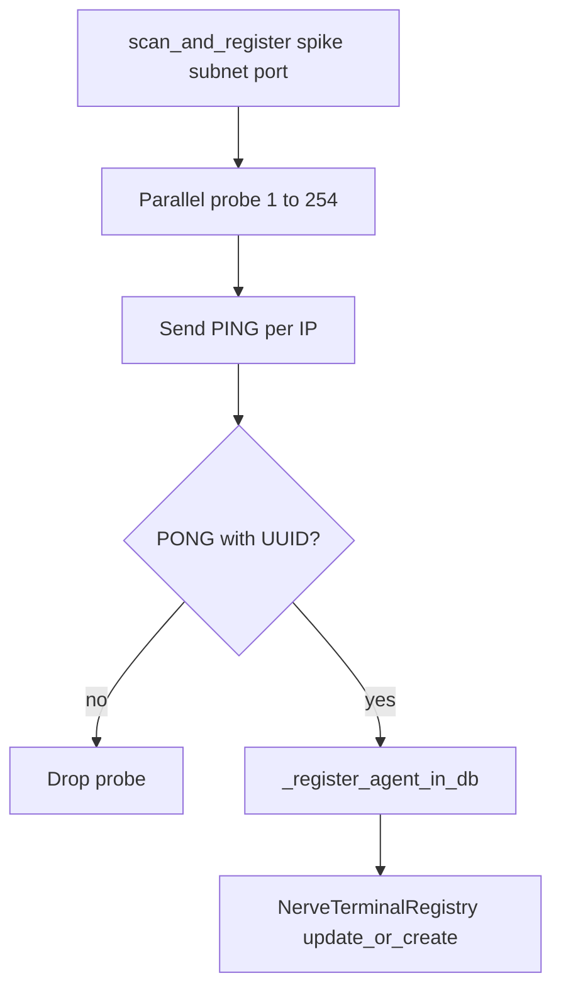
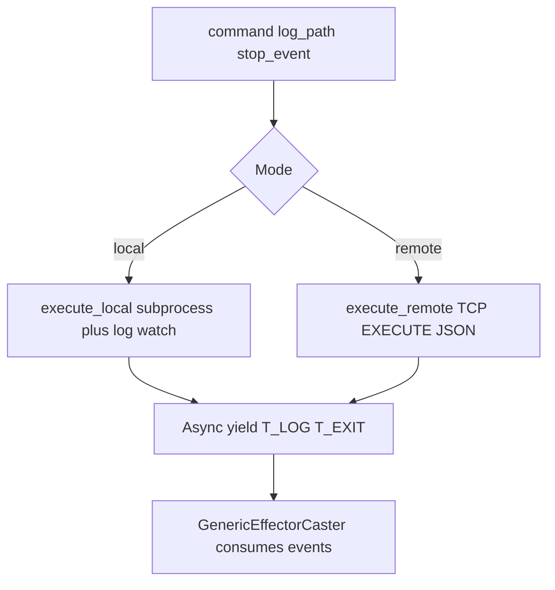

# Peripheral Nervous System — Comprehensive Documentation

## Summary

The **peripheral_nervous_system** module discovers remote agents via subnet scan and executes commands locally or remotely. `NerveTerminal` provides a unified async pipeline yielding `NerveTerminalEvent` (T_LOG, T_EXIT) for both paths.

---

## Table of Contents

1. [Overview](#overview)
2. [Directory / Module Map](#directory--module-map)
3. [Public Interfaces](#public-interfaces)
4. [Execution and Control Flow](#execution-and-control-flow)
5. [Data Flow](#data-flow)
6. [Integration Points](#integration-points)
7. [Configuration and Conventions](#configuration-and-conventions)
8. [Extension and Testing Guidance](#extension-and-testing-guidance)
9. [Visualizations](#visualizations)
10. [Mathematical Framing](#mathematical-framing)

---

## Target: peripheral\_nervous\_system/

### Overview

**Purpose:** The PNS discovers remote agents via subnet scan and executes commands locally or remotely. NerveTerminal uses the same pipeline for both: async subprocess + log tailing, yielding `NerveTerminalEvent` (T\_LOG, T\_EXIT). Remote execution is JSON-over-TCP.

**Connections in the wider system:**

*   **GenericEffectorCaster**: Calls `NerveTerminal.execute_local()` or `NerveTerminal.execute_remote()`
*   **CNS**: Distribution modes (ONE\_AVAILABLE\_AGENT, ALL\_ONLINE\_AGENTS, SPECIFIC\_TARGETS) use NerveTerminalRegistry
*   **scan\_and\_register**: Native handler for agent discovery

***

### Directory / Module Map

```
peripheral_nervous_system/
├── __init__.py
├── admin.py
├── api.py, api_urls.py
├── autonomic_nervous_system.py
├── nerve_terminal.py      # NerveTerminal, NerveTerminalEvent
├── peripheral_nervous_system.py # scan_and_register
├── models.py              # NerveTerminalRegistry, NerveTerminalStatus
├── serializers.py
├── urls.py, views.py
├── utils/client.py
└── tests/
```

***

### Public Interfaces

| Interface                                                                          | Type            | Purpose                                                |
| ---------------------------------------------------------------------------------- | --------------- | ------------------------------------------------------ |
| `NerveTerminal.execute_local(command, log_path, stop_event)`                       | Async generator | Yields NerveTerminalEvent (T\_LOG, T\_EXIT)            |
| `NerveTerminal.execute_remote(hostname, executable, params, log_path, stop_event)` | Async generator | Same interface over TCP                                |
| `scan_and_register(spike_id, subnet_prefix, port)`                                 | Async function  | Scans subnet, PING/PONG, upserts NerveTerminalRegistry |
| `NerveTerminalEvent`                                                               | NamedTuple      | type, text, code                                       |
| `NerveTerminalRegistry`                                                            | Model           | hostname, ip\_address, status (ONLINE), last\_seen     |


***

### Execution and Control Flow

1.  **Discovery:** `scan_and_register` → parallel `_probe_agent(ip, port)` for 1–254 → PING → PONG with UUID → `_register_agent_in_db`
2.  **Local execution:** `execute_local` → subprocess + watchfiles on log\_path → stream T\_LOG, on exit T\_EXIT
3.  **Remote execution:** `execute_remote` → TCP connect → send EXECUTE JSON → stream T\_LOG/T\_EXIT from agent
4.  **Stop:** stop\_event set → graceful ask then kill

***

### Data Flow

```
Discovery: subnet 192.168.1.1–254 → PING → PONG{UUID, hostname, version}
    → NerveTerminalRegistry.update_or_create(id=UUID, ...)

Execution: full_cmd, log_path
    → execute_local | execute_remote
    → NerveTerminalEvent(type=T_LOG, text=...) | (type=T_EXIT, code=...)
    → GenericEffectorCaster async for event
```

***

### Integration Points

| Consumer                | Usage                                                  |
| ----------------------- | ------------------------------------------------------ |
| `GenericEffectorCaster` | `NerveTerminal.execute_local/execute_remote`           |
| `CNS`                   | `NerveTerminalRegistry`for distribution mode targeting |
| `scan_and_register`     | Native handler in NATIVE\_HANDLERS                     |


***

### Configuration and Conventions

*   **SCAN\_TIMEOUT:** 1.5 s per probe
*   **Subnet:** From settings `TALOS_SUBNET` (default `192.168.1.`)
*   **Port:** From settings `TALOS_PORT` (default 5005)

***

### Extension and Testing Guidance

**Extension points:**

*   Extend discovery protocol (new commands)
*   Add new NerveTerminalEvent types

**Tests:** `peripheral_nervous_system/tests/`

***

## Visualizations

### Discovery and registry upsert

Subnet sweep with timeout; successful PONG carries agent identity for `NerveTerminalRegistry`.



### Local vs remote execution

Both paths yield the same `NerveTerminalEvent` stream for `GenericEffectorCaster`.



***

## Mathematical Framing

### Discovery Protocol

Let $\mathcal{I} = \{\text{ip}_1, \ldots, \text{ip}_{254}\}$ be the subnet. For each $\text{ip} \in \mathcal{I}$:

$$
\text{probe}(\text{ip}) \to \text{AgentIdentity}(\text{uuid}, \text{ip}, \text{hostname}, \text{version}) \mid \bot
$$

Success when: connect within timeout, send PING, receive PONG with valid UUID.

### AgentIdentity

$$
\text{AgentIdentity} = (\text{unique\_id}, \text{ip\_address}, \text{hostname}, \text{version})
$$

Registration: $\text{NerveTerminalRegistry.update\_or\_create}(\text{id}=\text{unique\_id}, \ldots)$.

### NerveTerminalEvent Taxonomy

$$
\text{EventType} \in \{\text{T\_LOG}, \text{T\_EXIT}\}
$$

$$
\text{NerveTerminalEvent} = (\text{type}, \text{text}, \text{code})
$$

For T\_LOG: $\text{text}$ = log chunk, $\text{code}$ unused. For T\_EXIT: $\text{code}$ = exit code.

### Execution Semantics

Both local and remote yield the same event shape. The pipeline is:

$$
\text{command} \to \text{process} \to \text{stream}(\text{T\_LOG}^*) \to \text{T\_EXIT}
$$

### Invariants (from code)

1.  **Unified interface:** Local and remote use identical `NerveTerminalEvent` structure.
2.  **Connection loss:** Remote connection drop kills child process.
