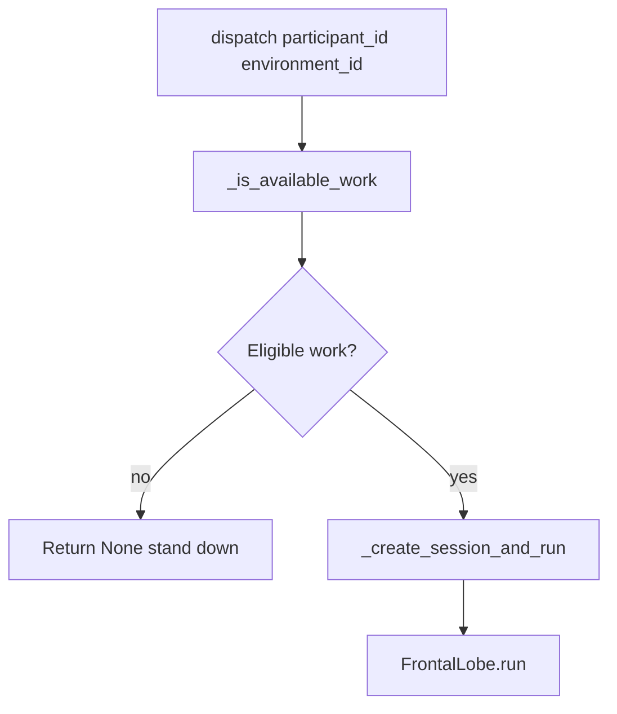
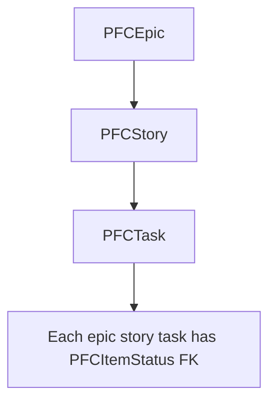

# Prefrontal Cortex — Comprehensive Documentation

## Summary

The **prefrontal_cortex** module manages the Agile work graph (Epic → Story → Task) and acts as the "bouncer": it evaluates whether an `IterationShiftParticipant` has eligible work before creating a ReasoningSession. If no work exists, the worker is stood down.

---

## Table of Contents

1. [Overview](#overview)
2. [Directory / Module Map](#directory--module-map)
3. [Public Interfaces](#public-interfaces)
4. [Execution and Control Flow](#execution-and-control-flow)
5. [Data Flow](#data-flow)
6. [Integration Points](#integration-points)
7. [Configuration and Conventions](#configuration-and-conventions)
8. [Extension and Testing Guidance](#extension-and-testing-guidance)
9. [Visualizations](#visualizations)
10. [Mathematical Framing](#mathematical-framing)

---

## Target: prefrontal\_cortex/

### Overview

**Purpose:** The prefrontal cortex manages the Agile work graph (Epic → Story → Task) and acts as the "bouncer": it evaluates whether an `IterationShiftParticipant` has eligible work before creating a ReasoningSession. If no work exists, the worker is stood down.

**Connections in the wider system:**

*   **temporal\_lobe**: Calls `PrefrontalCortex.dispatch()` for each pending participant
*   **frontal\_lobe**: Creates ReasoningSession and runs FrontalLobe when work exists
*   **hypothalamus** (via frontal\_lobe): model selection for spawned sessions (not the **thalamus** Django app used for the chat-bubble pathway)
*   **identity**: `IdentityType` (PM, WORKER) determines work-eligibility logic
*   **parietal\_lobe**: `mcp_ticket` tools operate on PFC models

***

### Directory / Module Map

```
prefrontal_cortex/
├── __init__.py
├── admin.py
├── api.py
├── constants.py
├── models.py           # PFCEpic, PFCStory, PFCTask, PFCComment, PFCItemStatus
├── prefrontal_cortex.py # PrefrontalCortex, _is_available_work
├── serializers.py
├── urls.py, views.py
└── tests/
```

***

### Public Interfaces

| Interface                                                                       | Type           | Purpose                                                                                                                  |
| ------------------------------------------------------------------------------- | -------------- | ------------------------------------------------------------------------------------------------------------------------ |
| `PrefrontalCortex.dispatch(participant_id, environment_id)`                     | Async method   | Evaluates work, creates session if eligible                                                                              |
| `_is_available_work(shift_id, identity_type_id, identity_disc, environment_id)` | Async function | Shift × IdentityType → work-eligibility predicate                                                                        |
| `PFCEpic`,`PFCStory`,`PFCTask`                                                  | Models         | Work graph; status via`PFCItemStatus`                                                                                    |
| `PFCItemStatus`                                                                 | Lookup Model   | NEEDS\_REFINEMENT, BACKLOG, SELECTED\_FOR\_DEVELOPMENT, IN\_PROGRESS, IN\_REVIEW, BLOCKED\_BY\_USER, DONE, WILL\_NOT\_DO |


***

### Execution and Control Flow

1.  **Entry:** `TemporalLobe` locks pending participants, calls `PrefrontalCortex(spike_id).dispatch(participant_id, env_id)`
2.  **Work check:** `_is_available_work(shift_id, identity_type_id, identity_disc, env_id)` → bool
3.  **Bouncer:** If `False`, return `None`; TemporalLobe stands down worker
4.  **Session:** If `True`, `_create_session_and_run()` → ReasoningSession, FrontalLobe.run()
5.  **Completion:** Participant status → COMPLETED

***

### Data Flow

```
IterationShiftParticipant (shift, iteration_participant)
    → _is_available_work(shift_id, identity_type_id, identity_disc, env_id)
    → Query PFCEpic, PFCStory by status + environment + owning_disc
    → Match Shift × IdentityType → predicate
    → If true: ReasoningSession.create(identity_disc, participant) → FrontalLobe.run()
```

***

### Integration Points

| Consumer                      | Usage                                    |
| ----------------------------- | ---------------------------------------- |
| `temporal_lobe`               | `PrefrontalCortex.dispatch()`            |
| `identity.addons.agile_addon` | Injects shift-specific work instructions |
| `parietal_lobe.mcp_ticket`    | CRUD on PFCEpic, PFCStory, PFCTask       |


***

### Configuration and Conventions

*   **PFCItemStatus:** Lookup Model pattern (BigIdMixin, NameMixin); IDs 1–8
*   **Work graph:** Epic → Story → Task; each has status, owning\_disc, previous\_owners

***

### Extension and Testing Guidance

**Extension points:**

*   Add new shift × identity\_type handlers in `_is_available_work` match/case
*   Extend PFC models for new work item types

**Tests:** `prefrontal_cortex/tests/`

***

## Visualizations

### `PrefrontalCortex.dispatch`

Work predicate gates session creation; otherwise temporal lobe stands the participant down.



### Work graph boxes

Epic, story, and task rows each carry a `PFCItemStatus` FK; edges are parent-child only at a high level.



***

## Mathematical Framing

### Work Graph Structure

Let $\mathcal{E}$, $\mathcal{S}$, $\mathcal{T}$ denote sets of Epics, Stories, Tasks. The graph is:

$$
\mathcal{G}_{\text{PFC}} = (\mathcal{E} \cup \mathcal{S} \cup \mathcal{T}, R_{\text{epic}}, R_{\text{story}})
$$

Where:

*   $R_{\text{epic}} \subseteq \mathcal{S} \times \mathcal{E}$ (story belongs to epic)
*   $R_{\text{story}} \subseteq \mathcal{T} \times \mathcal{S}$ (task belongs to story)

Each item has: $\text{status} \in \text{PFCItemStatus}$, $\text{owning\_disc}$, $\text{environment}$.

### Shift × IdentityType Work Predicates

Define $W(\text{shift}, \text{identity\_type}, \text{disc}, \text{env})$ = "has eligible work". The implementation is a finite function table:

| Shift           | PM                                     | Worker                                          |
| --------------- | -------------------------------------- | ----------------------------------------------- |
| SIFTING         | Epics/Stories NEEDS\_REFINEMENT in env | Bidding (BACKLOG, unowned) or Sifting           |
| PRE\_PLANNING   | BACKLOG in env                         | Sifting                                         |
| PLANNING        | (none)                                 | Sifting                                         |
| EXECUTING       | (none)                                 | SELECTED\_FOR\_DEVELOPMENT (owned or available) |
| POST\_EXECUTION | IN\_REVIEW → Blocked/Selected          | Bidding                                         |
| SLEEPING        | (always true)                          | (always true)                                   |


Formally, $W$ is defined by async predicates (e.g. `sifting_pm`, `executing_worker`) that query the DB.

### Invariants (from code)

1.  **Single work check:** No session is created without `_is_available_work` returning True.
2.  **Stand-down:** If no work, participant reverts to SELECTED (not ACTIVATED).
