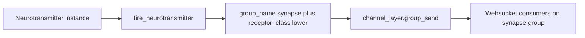
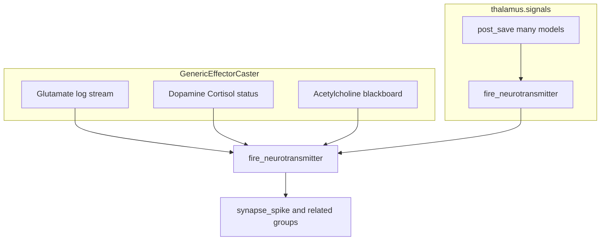

# Synaptic Cleft — Comprehensive Documentation

## Summary

The **synaptic_cleft** module provides real-time push of execution state to the UI via WebSocket neurotransmitter events. Biologically themed: Glutamate (log), Dopamine (positive status), Cortisol (negative status), Acetylcholine (memory/blackboard).

---

## Table of Contents

1. [Overview](#overview)
2. [Directory / Module Map](#directory--module-map)
3. [Public Interfaces](#public-interfaces)
4. [Execution and Control Flow](#execution-and-control-flow)
5. [Data Flow](#data-flow)
6. [Integration Points](#integration-points)
7. [Configuration and Conventions](#configuration-and-conventions)
8. [Extension and Testing Guidance](#extension-and-testing-guidance)
9. [Visualizations](#visualizations)
10. [Mathematical Framing](#mathematical-framing)

---

## Target: synaptic\_cleft/

### Overview

**Purpose:** The synaptic cleft provides real-time push of execution state to the UI. Websocket consumers join channel groups named `synapse_{receptor_class}` (see `fire_neurotransmitter`) and receive neurotransmitter events. Biologically themed: Glutamate (excitatory log), Dopamine (positive status), Cortisol (negative status), Acetylcholine (memory/blackboard).

**Connections in the wider system:**

*   **GenericEffectorCaster**: Fires Glutamate (log), Dopamine/Cortisol (status), Acetylcholine (blackboard)
*   **thalamus** (`thalamus.signals`): `post_save` on `ReasoningSession`, `ReasoningTurn`, `Spike`, `SpikeTrain`, `ChatMessage`, PFC entities, temporal iteration models, etc. → `fire_neurotransmitter` (Dopamine/Cortisol for status, Acetylcholine for chat/tool payloads and entity “saved” pings)
*   **dashboard**: Websocket consumer subscribes to channel groups

***

### Directory / Module Map

```
synaptic_cleft/
├── __init__.py
├── admin.py
├── axons.py
├── axon_hillok.py       # fire_neurotransmitter
├── constants.py         # NeurotransmitterEvent, LogChannel
├── dendrites.py
├── models.py
├── neurotransmitters.py # Glutamate, Dopamine, Cortisol, Acetylcholine
├── views.py
└── tests.py
```

***

### Public Interfaces

| Interface                            | Type           | Purpose                                                                                      |
| ------------------------------------ | -------------- | -------------------------------------------------------------------------------------------- |
| `fire_neurotransmitter(transmitter)` | Async function | Sends to`synapse_{receptor_class}`(lowercase), e.g.`synapse_spike`for CNS log/status traffic |
| `Glutamate`                          | Pydantic model | Log streaming;`vesicle`: channel + message                                                   |
| `Dopamine`                           | Pydantic model | Positive status;`new_status`, optional`vesicle`                                              |
| `Cortisol`                           | Pydantic model | Negative/halt status;`new_status`, optional`vesicle`                                         |
| `Acetylcholine`                      | Pydantic model | Entity/chat sync;`activity`,`vesicle`payload                                                 |


***

### Execution and Control Flow

1.  **Emit:** Caller constructs neurotransmitter, calls `fire_neurotransmitter(transmitter)`
2.  **Route:** `group_name = f"synapse_{transmitter.receptor_class.lower()}"` (see `axon_hillok.fire_neurotransmitter`)
3.  **Send:** `channel_layer.group_send(group_name, transmitter.to_synapse_dict())`
4.  **Consume:** Websocket consumer receives `type=release_neurotransmitter`, `payload=...`

***

### Data Flow

```
GenericEffectorCaster / AsyncLogManager
    → Glutamate(receptor_class='Spike', dendrite_id=spike_uuid, channel=EXECUTION|APPLICATION, message)
    → Dopamine / Cortisol (receptor_class='Spike', dendrite_id=spike_uuid, status)
    → Acetylcholine (blackboard updates)
    → fire_neurotransmitter → group synapse_spike

thalamus.signals (post_save)
    → Dopamine | Cortisol (model status) | Acetylcholine (chat, tool calls, entity saved)
    → fire_neurotransmitter → same channel layer
```

***

### Integration Points

| Consumer                | Usage                                                                                                 |
| ----------------------- | ----------------------------------------------------------------------------------------------------- |
| `GenericEffectorCaster` | `_mirror_to_socket`(Glutamate),`_update_status`(Dopamine/Cortisol), blackboard update (Acetylcholine) |
| `thalamus.signals`      | Broadcasts UI-facing state without going through CNS effectors                                        |


***

### Configuration and Conventions

*   **Group prefix:** `synapse_` + receiver model class name (lowercase)
*   **Release method:** `release_neurotransmitter`
*   **NeurotransmitterEvent:** LOG, STATUS, BLACKBOARD

***

### Extension and Testing Guidance

**Extension points:**

*   Add new neurotransmitter subtypes (inherit Neurotransmitter, set event)
*   Extend LogChannel for new log categories

**Tests:** `synaptic_cleft/tests.py`

***

## Visualizations

### `fire_neurotransmitter` routing

Channel group name derives from `receptor_class` on the transmitter payload.



### Producer subgraphs

CNS effector mirroring uses `receptor_class Spike` for log and status; thalamus `post_save` uses model class names for UI cache keys.



***

## Mathematical Framing

### Event Type Taxonomy

Let $\mathcal{E}$ be the set of neurotransmitter event types:

$$
\mathcal{E} = \{\text{LOG}, \text{STATUS}, \text{BLACKBOARD}\}
$$

Mapping to neurotransmitter classes:

$$
\text{Glutamate} \mapsto \text{LOG}, \quad \text{Dopamine}, \text{Cortisol} \mapsto \text{STATUS}, \quad \text{Acetylcholine} \mapsto \text{BLACKBOARD}
$$

### Signal Space

Each neurotransmitter $n$ has:

*   $\text{receptor\_class} \in \text{str}$ (e.g. `Spike`, `ReasoningSession`, `ChatMessage`)
*   $\text{dendrite\_id} \in \text{UUID} \cup \{\epsilon\}$ (primary row id for UI cache keys)
*   $\text{molecule}$, $\text{activity}$, optional $\text{vesicle}$
*   $\text{timestamp} \in \text{datetime}$

Additional fields by type:

*   Glutamate: `vesicle` holds `channel` (execution/application) and `message`
*   Dopamine/Cortisol: `new_status` string; optional structured `vesicle`
*   Acetylcholine: `vesicle` holds model-specific payload (e.g. chat text, entity fields)

### Group Routing

Implementation uses **class-scoped** groups:

$$
G(\text{class}) = \text{``synapse\_''} \oplus \text{lower}(\text{receptor\_class})
$$

Some call sites (e.g. CNS effectors) still conceptually tie traffic to a spike; `thalamus.signals` uses model class names (`ReasoningSession`, `ChatMessage`, etc.) as `receptor_class`.

### Invariants (from code)

1.  **Strict typing:** All neurotransmitters inherit `Neurotransmitter` (Pydantic BaseModel).
2.  **Channel layer required:** If no channel layer, neurotransmitter is dropped (logged).
