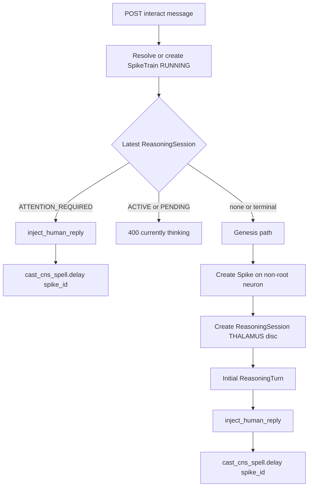
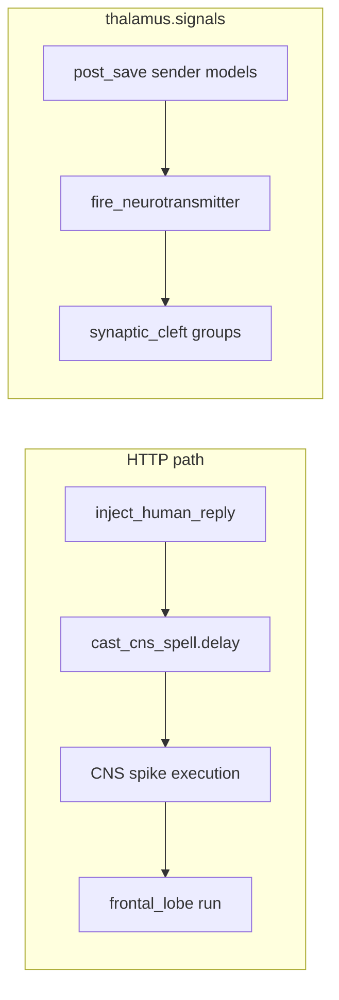

# Thalamus — Comprehensive Documentation

## Summary

The **thalamus** module exposes the chat-bubble REST API for the dedicated `NeuralPathway.THALAMUS` pathway. It manages standing spike trains, injects human replies into paused reasoning sessions, and broadcasts entity state changes to **synaptic_cleft** (Dopamine, Cortisol, Acetylcholine) across many model types. The ORM module `thalamus.models` only defines a lightweight `Stimulus` helper; persistence lives in CNS and frontal_lobe.

---

## Table of Contents

1.  [Overview](#overview)
2.  [Directory / Module Map](#directory--module-map)
3.  [Public Interfaces](#public-interfaces)
4.  [Execution and Control Flow](#execution-and-control-flow)
5.  [Data Flow](#data-flow)
6.  [Integration Points](#integration-points)
7.  [Configuration and Conventions](#configuration-and-conventions)
8.  [Extension and Testing Guidance](#extension-and-testing-guidance)
9.  [Visualizations](#visualizations)
10. [Mathematical Framing](#mathematical-framing)

***

## Target: thalamus/

### Overview

**Purpose:** Expose REST actions for “send message” and “list messages” against the dedicated Thalamus pathway; keep the standing train and session wired to `IdentityDisc.THALAMUS`; delegate execution to Celery via `cast_cns_spell.delay(spike_id)` after human injection.

**Naming note:** Do not confuse this package with **hypothalamus** (model routing) or with historical references to a removed `frontal_lobe/thalamus.py` module.

**Connections in the wider system:**

*   **central\_nervous\_system**: `NeuralPathway.THALAMUS`, `SpikeTrain`, `Spike`, `cast_cns_spell`

*   **frontal\_lobe**: `ReasoningSession`, `ReasoningTurn`, `ChatMessage`, `ReasoningStatusID`

*   **identity**: `IdentityDisc.THALAMUS` UUID for default genesis session

*   **synaptic\_cleft**: `thalamus.signals` → `fire_neurotransmitter`

***

### Directory / Module Map

```
thalamus/
├── __init__.py
├── apps.py               # imports thalamus.signals on ready
├── api.py                # ThalamusViewSet (interact, messages)
├── thalamus.py           # get_chat_history, inject_human_reply
├── serializers.py        # Request/response DTOs and message list schema
├── signals.py            # post_save → websocket neurotransmitters
├── urls.py               # V2 router registration
├── types.py
└── models.py             # Stimulus (lightweight; not the main persistence layer)
```

***

### Public Interfaces

| Interface                                           | Type        | Purpose                                                                                                                              |
| --------------------------------------------------- | ----------- | ------------------------------------------------------------------------------------------------------------------------------------ |
| `ThalamusViewSet.interact`                          | POST action | Accepts `message`; ensures standing train; re-ignites paused session, rejects if busy, or spawns spike + session + genesis injection |
| `ThalamusViewSet.messages`                          | GET action  | Returns `ThalamusMessageListDTO` for assistant-ui (non-volatile user/assistant turns)                                                |
| `get_chat_history(session, include_volatile=False)` | Function    | Maps `ChatMessage` rows to `ThalamusMessageDTO` list                                                                                 |
| `inject_human_reply(session, user_text)`            | Function    | When `ATTENTION_REQUIRED`: append user `ChatMessage`, set `ACTIVE`, `cast_cns_spell.delay(spike_id)`                                 |
| `ThalamusRequestSerializer`                         | DRF         | `message` field                                                                                                                      |
| `ThalamusMessageListSerializer`                     | DRF         | List of `{role, content}`                                                                                                            |


***

### Execution and Control Flow

1.  **interact:** Resolve `SpikeTrain` for `pathway_id = NeuralPathway.THALAMUS` (create if missing; ensure `RUNNING`).

2.  **If** latest `ReasoningSession` is `ATTENTION_REQUIRED`: `inject_human_reply` → Celery `cast_cns_spell`.

3.  **Elif** session `ACTIVE` or `PENDING`: return 400 “currently thinking.”

4.  **Else (genesis):** Create `Spike` on non-root neuron, `ReasoningSession` with `IdentityDisc.THALAMUS`, initial `ReasoningTurn`, then `inject_human_reply` (which requires `ATTENTION_REQUIRED` — session is created in that status before injection).

5.  **messages:** Same `SpikeTrain` / latest session → `get_chat_history` excluding volatile messages by default.

***

### Data Flow

```
POST /thalamus/interact
    → SpikeTrain (THALAMUS pathway)
    → ReasoningSession (optional create + Spike)
    → ChatMessage (inject_human_reply)
    → cast_cns_spell.delay(spike_id)
    → CNS → frontal_lobe (Hypothalamus routing elsewhere)

GET /thalamus/messages
    → ChatMessage (user/assistant, non-volatile)
    → ThalamusMessageListDTO

post_save (many senders)
    → fire_neurotransmitter(Dopamine | Cortisol | Acetylcholine)
    → synaptic_cleft groups
```

***

### Integration Points

| Consumer                      | Usage                                                            |
| ----------------------------- | ---------------------------------------------------------------- |
| `config.urls`                 | Registers `V2_THALAMUS` router under API v2                      |
| `GenericEffectorCaster` / CNS | Indirect: `cast_cns_spell` continues execution after human reply |
| `synaptic_cleft`              | `thalamus.signals` emits status and chat events                  |


***

### Configuration and Conventions

*   **Permissions:** `ThalamusViewSet` uses `AllowAny` (tighten for production if needed).

*   **Standing train:** One canonical `SpikeTrain` per `NeuralPathway.THALAMUS` query pattern (latest by `created`).

***

### Extension and Testing Guidance

*   Add auth or rate limits on `interact` if exposing to untrusted clients.

*   When changing session status transitions, keep `inject_human_reply` preconditions aligned with `ThalamusViewSet` branches.

***

## Visualizations

### `ThalamusViewSet.interact` branches

Standing `SpikeTrain` on `NeuralPathway.THALAMUS`; latest `ReasoningSession` drives the branch.



### Human reply and synaptic broadcast

`inject_human_reply` schedules CNS continuation; `post_save` on many thalamus-related models fans out to `fire_neurotransmitter` by receptor class.



***

## Mathematical Framing

No dedicated equation set; pathway selection is a fixed UUID (`NeuralPathway.THALAMUS`). Message ordering is chronological by `ChatMessage.created`.
